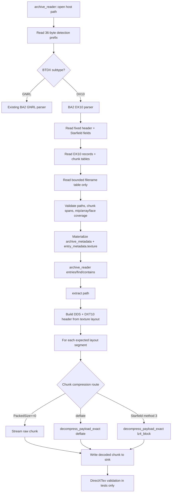

# Phase 06: DDS Boundary and BA2 DX10 Read/Reconstruction - Research

**Researched:** 2026-05-08  
**Domain:** C++20 BA2 DX10/DDS archive parsing, DDS reconstruction, and private DirectXTex validation  
**Confidence:** HIGH for DDS/DirectXTex/header mechanics and current code integration; MEDIUM for Bethesda-specific unknown BA2 DX10 fields and broad real-game variant coverage.

<user_constraints>
## User Constraints (from CONTEXT.md)

### Locked Decisions

#### Texture Metadata Surface
- **D-01:** Expose BA2 DX10 texture metadata as a DX10-only optional value on `entry_metadata`, not as a separate public reader object or texture-specific lookup method.
- **D-02:** Keep the public texture metadata dependency-light and minimal. Add the required value structs now, but avoid public helper methods, display names, or large enums that can wait for documentation or validation phases.
- **D-03:** Expose the texture format as a raw numeric DXGI format identifier (`uint32_t` or equivalent), not as a public DXGI type, DirectXTex type, or incomplete libbsa enum.
- **D-04:** Represent cubemap and array state with explicit fields such as dimensions, mip count, array size, and `is_cubemap`. Do not require callers to interpret DDS flags just to answer common questions.
- **D-05:** Expose a public per-entry chunk list for BA2 DX10 entries. Chunk metadata should include enough libbsa-owned information to understand chunk layout, archive-absolute payload offsets, stored/raw sizes, and compression route without exposing private parser structs.
- **D-06:** For BA2 DX10 entries, `entry_metadata::raw_size` should mean the consumer-visible extracted DDS byte size, including the reconstructed DDS header. Archive chunk metadata carries archive payload sizes separately.
- **D-07:** Preserve archive-derived raw DX10 record fields in clearly named libbsa-owned metadata when they affect reconstruction or future compatibility evidence. Keep fields with unknown semantics raw and do not invent meaning before reference evidence exists.
- **D-08:** Populate the optional texture metadata only for BA2 DX10 entries. Existing BSA and BA2 GNRL entries keep `std::nullopt` semantics.

#### DDS Output Contract
- **D-09:** Reconstructed BA2 DX10 extraction output should always use standard DDS magic/header plus a `DDS_HEADER_DXT10` extension. Do not spend Phase 6 effort choosing legacy DDS header encodings for formats that could technically fit.
- **D-10:** DirectXTex validation in automated tests must load every generated reconstructed DDS output and report manifest-matching dimensions, mip count, raw DXGI format id, array size, and cubemap state.
- **D-11:** Tests should also verify that decoded payload bytes after the reconstructed header match the expected fixture payload bytes in validated DDS order. Do not require whole-file byte equality for header padding/details beyond the contract needed for metadata and payload proof.
- **D-12:** Normal runtime extraction should not call DirectXTex before returning success. Extraction builds deterministic DDS bytes; DirectXTex remains an internal analyzer/validation dependency used by implementation/test boundaries, not a per-extract runtime gate.
- **D-13:** Sink-based extraction writes the reconstructed DDS header first, then decoded chunk payloads in validated DDS order. Preserve sink-first semantics and keep buffering bounded per texture chunk rather than assembling the whole DDS before writing.
- **D-14:** `extract_bytes(path)` for BA2 DX10 returns exactly the same reconstructed DDS byte stream that `extract(path, sink)` writes, including header and decoded chunks.
- **D-15:** Validate BA2 chunk metadata against the expected DDS mip/array/face order and assemble output in computed DDS order. Do not blindly concatenate archive chunk order if it conflicts with the expected texture layout.
- **D-16:** Malformed DX10 layout problems that can be detected from metadata - truncated tables, invalid spans, inconsistent counts/sizes, mip/face gaps, duplicate coverage, or impossible coverage - should fail during `archive_reader::open` with `error_code::format_error`.
- **D-17:** Bad compressed chunks or exact decoded-size mismatches remain malformed archive content and should return `error_code::format_error`, matching BA2 GNRL behavior.
- **D-18:** DDS DXT10 fields that are not clearly represented in BA2 records should use conservative documented defaults. Researcher/planner should trace reference behavior where available, but Phase 6 should not block on exact reproduction of unclear header metadata that DirectXTex does not require for the locked acceptance criteria.
- **D-19:** Preserve BA2 GNRL path behavior for DX10 entries: canonical lowercase `/` lookup keys, `original_path` preservation, duplicate canonical path rejection, and `not_found` for valid missing paths.

#### Fixture Coverage Shape
- **D-20:** Use a small rich generated success matrix rather than one huge archive or many one-case archives. The matrix must cover generated Fallout 4 and Starfield v3 DX10 archives, raw chunks, FO4 deflate chunks, Starfield raw-LZ4-block chunks, cubemap state, array state, and representative mip/chunk layouts.
- **D-21:** Generated texture payloads should be tiny, deterministic, legal, and DirectXTex-loadable after DDS reconstruction. Prioritize compact metadata-valid textures over broad production-like format coverage.
- **D-22:** Mandatory malformed fixture coverage should be focused on the Phase 6 SPEC: truncated DX10 headers/records/chunks, invalid payload spans, inconsistent chunk sizes/counts, bad compressed chunks, decoded-size mismatches, and mip/face coverage gaps or duplicates.
- **D-23:** DX10 fixture manifests should be rich dual metadata manifests. Record archive-side records/chunks, expected public texture metadata, expected DirectXTex-loaded DDS metadata, compression route, payload ordering, and decoded payload hashes or bytes.
- **D-24:** Fixture generation code and committed outputs stay under project test fixture tooling, outside `TES5Edit/`, with legal provenance documented like prior generated fixture phases.

#### Analyzer Boundary Reuse
- **D-25:** Add a reusable internal texture-layout/analyzer core in Phase 6. It should support this phase's DDS reconstruction and validation work while giving Phase 9 a clean place to extend writer-side DDS input analysis later.
- **D-26:** Wire DirectXTex through CMake as a private `libbsa` dependency behind the internal analyzer boundary. Installed public headers must remain free of DirectXTex, DXGI, Windows SDK, and other private dependency types.
- **D-27:** Internal analyzer APIs should translate DirectXTex metadata immediately into libbsa-owned internal/public-compatible texture layout values. Do not pass DirectXTex types across module seams.
- **D-28:** Do not implement Phase 9 writer behavior in Phase 6. Names and data shapes may be reusable, but Phase 6 must not parse DDS input for BA2 writing or generate BA2 texture chunks from DDS input.

#### Carry-Forward Decisions
- **D-29:** Preserve the established public `archive_reader` facade: `open`, `metadata`, deterministic `entries`, normalized `find`/`contains`, and `extract(path, sink)`, and `extract_bytes(path)`.
- **D-30:** Preserve sink-first extraction and one-entry/one-chunk bounded buffering. Whole-archive reads and broad performance/concurrency work remain out of scope.
- **D-31:** Preserve metadata-driven compression routing. Raw, deflate, and Starfield v3 raw-LZ4-block decisions must come from parsed archive/chunk metadata, never host file extension or archive path spelling.
- **D-32:** Preserve exact-size decompression validation for each compressed DX10 chunk.
- **D-33:** Preserve stable error-code assertions in tests. Do not assert diagnostic message text.
- **D-34:** Preserve the TES5Edit boundary: trace reference behavior as needed, but do not edit, format, stage, compile, or use `TES5Edit/` as a fixture workspace.

### the agent's Discretion
- Researcher/planner may choose exact internal file names, helper boundaries, parser structs, and CMake target organization if the decisions above and `06-SPEC.md` are preserved.
- Researcher/planner should trace TES5Edit/BSArchPro and independent BA2/DDS references for DX10 record/chunk layout, mip/array/cubemap ordering, and DDS header reconstruction details before locking implementation tasks.
- Planner may choose exact fixture filenames, entry names, texture dimensions, mip counts, and payload bytes, as long as the small rich matrix and malformed coverage decisions above are satisfied.

### Deferred Ideas (OUT OF SCOPE)
None - discussion stayed within phase scope.
</user_constraints>

<phase_requirements>
## Phase Requirements

| ID | Description | Research Support |
|----|-------------|------------------|
| DDS-01 | Consumer can read Fallout 4 BA2 DX10/DDS texture archives. | BA2 DX10 header/record/chunk layout, FO4 v1 header size, parser routing, and fixture shape are documented below. |
| DDS-02 | Consumer can read Starfield BA2 v3 DX10/DDS texture archives. | Starfield v3 extra header fields and `CompressionMethod == 3` raw-LZ4-block routing are mapped from existing Phase 5 code and TES5Edit behavior. |
| DDS-03 | Consumer can inspect texture metadata including dimensions, mip count, DXGI format, cubemap/array information, and chunk layout. | Public metadata extension shape and chunk fields are specified under Standard Stack and Architecture Patterns. |
| DDS-04 | Consumer can extract BA2 DDS entries as valid DDS files with reconstructed headers. | DDS magic/header/`DDS_HEADER_DXT10` fields and DirectXTex validation API are cited from Microsoft/DirectXTex docs. |
| DDS-05 | Consumer can extract BA2 DDS chunks compressed with deflate or raw LZ4 block according to archive version and chunk metadata. | Compression routing reuses `detail::decompress_payload_exact` and maps chunk `PackedSize` plus archive default compression to raw/deflate/LZ4 block. |
| DDS-06 | Maintainer can validate reconstructed DDS outputs through DirectXTex metadata loading without exposing DirectXTex types publicly. | DirectXTex private CMake linkage, internal adapter placement, and public include-boundary regression tests are specified. |
| DDS-07 | Consumer can extract cubemap textures with correct DDS metadata and face/mip ordering. | Cubemap DDS order and `DDS_HEADER_DXT10` cube metadata are cited from Microsoft DDS docs and cross-checked against TES5Edit. |
</phase_requirements>

## Summary

Phase 6 should be planned as a focused BA2 `DX10` reader/extractor extension, not as a general DDS writer or texture toolkit. BA2 DX10 archives share the existing BTDX header and filename table pattern with BA2 GNRL, but each texture entry has a 24-byte texture header followed by one 24-byte chunk record per mip-range chunk. TES5Edit reads fields as `NameHash`, 4-byte extension, `DirHash`, `UnknownTex`, `chunk_count`, fixed `chunk_header_size` (observed/written as 24), `height`, `width`, `NumMips`, byte-sized `DXGIFormat`, `CubeMaps`, then chunk records containing archive-absolute offset, packed size, raw size, start mip, end mip, and `BAADF00D`. [VERIFIED: TES5Edit/Core/wbBSArchive.pas lines 304-331, 1161-1189, 1713-1734] Independent BA2 references describe the same DX10 file declaration and chunk structure, with all fields little-endian and no padding. [CITED: https://miere.ru/posts/ba2-archive-format/] [CITED: https://bethesda-structs.readthedocs.io/en/latest/_modules/bethesda_structs/archive/btdx.html]

The correct planning center is three private layers: a BA2 DX10 parser that materializes public metadata without loading payload bytes, a texture/DDS layout module that computes valid DDS header bytes and expected mip/array/face coverage, and a BA2 DX10 extractor that writes the reconstructed DDS header then decoded chunks to the existing sink. DirectXTex should be linked privately and used by tests/internal validation to load reconstructed DDS bytes via `GetMetadataFromDDSMemory` or `LoadFromDDSMemory`, translating `TexMetadata` immediately into libbsa-owned values. [CITED: https://github.com/microsoft/directxtex/wiki/DDS-I-O-Functions] [CITED: https://github.com/microsoft/directxtex/wiki/TexMetadata] Public headers must not include DirectXTex, DXGI, Windows SDK, libdeflate, or lz4 headers. [VERIFIED: AGENTS.md] [VERIFIED: include/libbsa/archive.hpp]

**Primary recommendation:** Implement BA2 DX10 as a sibling private parser/reader to `ba2_gnrl_*`, extend `entry_metadata` with `std::optional<texture_metadata>`, always reconstruct a standard DDS header plus `DDS_HEADER_DXT10`, and validate all generated fixture outputs with DirectXTex metadata loading in tests.

## Project Constraints (from AGENTS.md)

- Implementation work must remain outside `TES5Edit/`; the submodule is read-only and must not be edited, formatted, staged, compiled into libbsa, or used as a fixture workspace. [VERIFIED: AGENTS.md]
- The implementation language is C++ and the public API must be clean, portable, reusable, and not a Delphi/Pascal transliteration. [VERIFIED: AGENTS.md]
- Preserve BSArchPro/TES5Edit-compatible archive-format behavior unless a documented reason to diverge exists. [VERIFIED: AGENTS.md]
- When porting non-obvious reference behavior, trace reference code first and record compatibility constraints near the new implementation. [VERIFIED: AGENTS.md]
- Use `libdeflate` for deflate, official `lz4` for LZ4, `DirectXTex` for texture analysis, and vcpkg for dependency management. [VERIFIED: AGENTS.md]
- Do not introduce speculative dependencies; prefer the C++ standard library until a concrete requirement justifies more. [VERIFIED: AGENTS.md]
- Add focused tests for archive parsing, writing, round-tripping, and compatibility behavior as surfaces are implemented. [VERIFIED: AGENTS.md]
- Prefer fixture-based tests proving byte-level or metadata-level compatibility with known archive behavior, and do not use `TES5Edit/` as a mutable test fixture. [VERIFIED: AGENTS.md]
- Do not delete accurate comments as cleanup; add comments for non-obvious why and Doxygen comments for public APIs or substantially rewritten methods. [VERIFIED: AGENTS.md]

## Architectural Responsibility Map

| Capability | Primary Tier | Secondary Tier | Rationale |
|------------|-------------|----------------|-----------|
| BA2 DX10 byte detection and open routing | Library public facade | BA2 parser internals | `archive_reader::open` already performs byte-driven BA2 routing before BSA fallback, while subtype-specific parsing belongs under private `formats/ba2`. [VERIFIED: src/archive.cpp] |
| DX10 record/chunk parsing | BA2 parser internals | Shared binary I/O | Checked little-endian table parsing belongs with BA2 format code and should reuse `detail::binary_reader` patterns from `ba2_gnrl_parser.cpp`. [VERIFIED: src/formats/ba2/ba2_gnrl_parser.cpp] |
| Public texture metadata | Public API value types | BA2 parser materialization | Metadata must be inspectable through `entry_metadata` without leaking DirectXTex/DXGI/private parser structs. [VERIFIED: 06-CONTEXT.md D-01..D-08] |
| DDS header reconstruction | Internal texture/DDS layout layer | BA2 DX10 extractor | DDS header bytes are deterministic library output and should be generated from libbsa-owned texture layout values, not from DirectXTex runtime gates. [VERIFIED: 06-CONTEXT.md D-09..D-14] |
| Chunk decode and sink streaming | BA2 DX10 extractor | Compression router | Extraction must write header first, then chunk-decoded payloads using existing exact-size codec routing and sink partial-write handling. [VERIFIED: src/formats/ba2/ba2_gnrl_reader.cpp] |
| DirectXTex validation | Tests/internal analyzer | CMake private dependency | DirectXTex validates reconstructed DDS output and future analyzer behavior but must remain a private dependency. [CITED: https://github.com/microsoft/directxtex/wiki/DDS-I-O-Functions] [VERIFIED: 06-CONTEXT.md D-25..D-28] |
| Fixture generation | Test fixture tooling | Tests/CMake | Generated legal fixtures and manifests live under `tests/fixtures/generated` and are wired through CTest/CMake patterns already used for BA2 GNRL. [VERIFIED: tests/fixtures/generated/generate_ba2_gnrl_fixtures.cpp] [VERIFIED: tests/CMakeLists.txt] |

## Standard Stack

### Core
| Library | Version | Purpose | Why Standard |
|---------|---------|---------|--------------|
| C++ | C++20 | Public API, parser, extraction, and fixture generator implementation | Project constraints require C++20 and current public headers already use C++20-compatible value/result shapes. [VERIFIED: AGENTS.md] [VERIFIED: include/libbsa/archive.hpp] |
| CMake | 3.24 minimum; local tool 4.3.2 | Build, private dependency wiring, CTest orchestration | Repository already uses CMake presets and CTest; local `cmake --version` reports 4.3.2. [VERIFIED: CMakeLists.txt] [VERIFIED: CMakePresets.json] [VERIFIED: local command] |
| vcpkg manifest mode | Baseline `12dcccadfe573d0eaa6c67a968413ded7805d256` | Dependency acquisition for libdeflate, lz4, DirectXTex, Catch2, nlohmann-json | `vcpkg.json` already declares required libraries, including DirectXTex and test-only JSON. [VERIFIED: vcpkg.json] |
| DirectXTex | vcpkg `2026-03-31#0` | Private DDS metadata validation/analyzer boundary | vcpkg lists DirectXTex `2026-03-31#0`, MIT license, Windows/Linux support, and DirectXTex docs expose DDS load/metadata APIs. [CITED: https://vcpkg.io/en/package/directxtex.html] [CITED: https://github.com/microsoft/directxtex/wiki/DDS-I-O-Functions] |
| libdeflate | vcpkg `1.25#0` | Exact-size deflate chunk decompression | vcpkg lists libdeflate `1.25#0`; existing compression router already exposes exact-size deflate routing. [CITED: https://vcpkg.io/en/package/libdeflate.html] [VERIFIED: src/detail/compression_router.cpp] |
| lz4 | vcpkg `1.10.0#0` | Starfield v3 raw LZ4 block chunk decompression | vcpkg lists lz4 `1.10.0#0`; existing raw-block codec and router are available. [CITED: https://vcpkg.io/en/package/lz4.html] [VERIFIED: src/detail/lz4_block_codec.cpp] |
| Catch2 + CTest | vcpkg Catch2 `3.14.0#0`; CTest local 4.3.2 | Unit, fixture, and regression validation | Existing tests use Catch2 with `catch_discover_tests`; vcpkg lists Catch2 `3.14.0#0`. [VERIFIED: tests/CMakeLists.txt] [CITED: https://vcpkg.io/en/package/catch2.html] |

### Supporting
| Library | Version | Purpose | When to Use |
|---------|---------|---------|-------------|
| nlohmann-json | manifest dependency in `vcpkg.json` | Test-only fixture manifest parsing | Continue using only in `libbsa_tests` and fixture tests; do not link into runtime/public API. [VERIFIED: vcpkg.json] [VERIFIED: tests/CMakeLists.txt] |
| TES5Edit / BSArchPro | Read-only submodule | Behavioral reference for BA2 DX10 structure and extraction behavior | Trace `wbBSArchive.pas` for field layout, cubemap flag interpretation, and compression behavior; never modify or compile it. [VERIFIED: AGENTS.md] [VERIFIED: TES5Edit/Core/wbBSArchive.pas] |
| Microsoft DDS documentation | Current Microsoft Learn pages fetched 2026-05-08 | DDS header, DXT10 extension, cube-map ordering, and array semantics | Use for deterministic DDS header reconstruction and test assertions. [CITED: https://learn.microsoft.com/windows/win32/direct3ddds/dds-header-dxt10] [CITED: https://learn.microsoft.com/windows/win32/direct3ddds/dx-graphics-dds-pguide] |

### Alternatives Considered
| Instead of | Could Use | Tradeoff |
|------------|-----------|----------|
| DirectXTex metadata validation | Hand-written DDS parser only | Hand parsing may validate generated fixtures narrowly, but DirectXTex is the project-approved texture analyzer and catches real DDS metadata compatibility. [VERIFIED: AGENTS.md] [CITED: https://github.com/microsoft/directxtex/wiki/DDS-I-O-Functions] |
| Always `DDS_HEADER_DXT10` | TES5Edit-style legacy headers for BC1/BC2/BC3/etc. | TES5Edit sometimes emits legacy DDS pixel formats, but the locked Phase 6 decision requires always using DXT10 to avoid per-format header selection work. [VERIFIED: 06-CONTEXT.md D-09] [VERIFIED: TES5Edit/Core/wbBSArchive.pas lines 2218-2375] |
| New public texture reader object | Optional texture metadata on `entry_metadata` | A separate public reader object contradicts D-01 and would expand API surface before write/validation phases. [VERIFIED: 06-CONTEXT.md D-01] |
| Compression by filename/archive extension | Parsed chunk/archive metadata | Filename inference contradicts existing BA2 policy and can corrupt Starfield v3 raw-LZ4 payload routing. [VERIFIED: 06-CONTEXT.md D-31] [VERIFIED: src/formats/ba2/ba2_format_detector.cpp] |

**Installation:** no new manifest dependency is required; add private CMake wiring for existing `directxtex` manifest dependency.

```bash
cmake --preset windows-msvc-debug-static
cmake --build --preset windows-msvc-debug-static
ctest --preset windows-msvc-debug-static
```

**Version verification:** Package versions were verified via vcpkg package pages instead of `npm view` because this is a C++/vcpkg project. [CITED: https://vcpkg.io/en/package/directxtex.html] [CITED: https://vcpkg.io/en/package/libdeflate.html] [CITED: https://vcpkg.io/en/package/lz4.html] [CITED: https://vcpkg.io/en/package/catch2.html]

## Architecture Patterns

### System Architecture Diagram



### Recommended Project Structure

```text
include/libbsa/
├── archive.hpp                       # extend entry_metadata with texture metadata optionals
src/formats/ba2/
├── ba2_format_detector.*             # allow DX10 detection instead of unsupported
├── ba2_dx10_parser.*                 # header/record/chunk/name parsing and public metadata materialization
├── ba2_dx10_reader.*                 # entries/find/contains/extract helpers for texture archives
├── ba2_gnrl_parser.*                 # existing sibling pattern to preserve
src/texture/
├── dds_layout.*                      # libbsa-owned layout, mip/face/array coverage, header byte construction
├── directxtex_analyzer.*             # private DirectXTex metadata load/translate boundary for tests/future Phase 9
tests/fixtures/generated/
├── generate_ba2_dx10_fixtures.cpp    # legal success + malformed DX10 fixture generator
tests/unit/
├── ba2_dx10_reader_tests.cpp         # manifest-backed parser/extraction/DirectXTex validation tests
```

### Pattern 1: Public dependency-light texture metadata

**What:** Add small value types to `archive.hpp`, e.g. `texture_chunk_metadata` and `texture_metadata`, with raw numeric `dxgi_format`, `width`, `height`, `mip_count`, `array_size`, `is_cubemap`, raw BA2 fields, and chunk list. [VERIFIED: 06-CONTEXT.md D-01..D-08]

**When to use:** Populate only for BA2 DX10 entries; keep BSA and BA2 GNRL entries as `std::nullopt`. [VERIFIED: 06-CONTEXT.md D-08]

**Example:**
```cpp
// Source: 06-CONTEXT.md D-01..D-08; include/libbsa/archive.hpp current public value style
struct texture_chunk_metadata {
  std::uint64_t payload_offset;
  std::uint32_t stored_size;
  std::uint32_t raw_size;
  std::uint16_t start_mip;
  std::uint16_t end_mip;
  entry_compression compression;
};

struct texture_metadata {
  std::uint32_t width;
  std::uint32_t height;
  std::uint32_t mip_count;
  std::uint32_t dxgi_format;
  std::uint32_t array_size;
  bool is_cubemap;
  std::uint8_t unknown_tex;
  std::uint16_t cube_maps_raw;
  std::vector<texture_chunk_metadata> chunks;
};
```

### Pattern 2: DDS DXT10 header construction from libbsa-owned layout

**What:** Always produce `DDS ` magic + 124-byte `DDS_HEADER` + 20-byte `DDS_HEADER_DXT10`, set legacy pixel format to `DDPF_FOURCC`/`DX10`, set DXT10 `dxgiFormat` from raw BA2 format, `resourceDimension = 3` for 2D textures, `arraySize` from layout, `miscFlag = 0x4` for cubemaps, and conservative `miscFlags2 = 0`. [VERIFIED: 06-CONTEXT.md D-09, D-18] [CITED: https://learn.microsoft.com/windows/win32/direct3ddds/dds-header-dxt10]

**When to use:** For every Phase 6 BA2 DX10 extraction; do not branch to legacy DXT1/DXT5-style headers. [VERIFIED: 06-CONTEXT.md D-09]

**Example:**
```cpp
// Source: Microsoft DDS_HEADER_DXT10 docs and Phase 6 D-09/D-18.
constexpr std::uint32_t dds_magic = 0x20534444U;       // "DDS "
constexpr std::uint32_t ddpf_fourcc = 0x00000004U;
constexpr std::uint32_t fourcc_dx10 = 0x30315844U;     // "DX10"
constexpr std::uint32_t dds_dimension_texture2d = 3U;
constexpr std::uint32_t dds_resource_misc_texturecube = 0x4U;

// Write DDS_HEADER.ddspf.dwFlags = ddpf_fourcc and dwFourCC = fourcc_dx10.
// Then write DDS_HEADER_DXT10 {dxgiFormat, texture2D, cube ? 0x4 : 0, arraySize, 0}.
```

### Pattern 3: Chunk coverage validation before extraction

**What:** Build an expected sequence of logical texture segments from `array_size`, cube state, `mip_count`, and chunk `start_mip..end_mip`; reject gaps, duplicates, impossible ranges, zero chunks, invalid spans, and counts that cannot account for all expected payload bytes. [VERIFIED: 06-CONTEXT.md D-15, D-16]

**When to use:** During open after parsing all records/chunks but before the reader is returned, because layout metadata errors are detectable without payload decompression. [VERIFIED: 06-CONTEXT.md D-16]

### Anti-Patterns to Avoid
- **Blind chunk concatenation:** This can pass simple fixtures but fail cubemaps/arrays when archive order conflicts with expected DDS face/mip order. Use computed DDS order. [VERIFIED: 06-CONTEXT.md D-15]
- **Calling DirectXTex during normal extraction:** This adds an unnecessary runtime gate and violates D-12; use DirectXTex in tests/internal analyzer boundaries only. [VERIFIED: 06-CONTEXT.md D-12]
- **Using LZ4 frame APIs for Starfield BA2 v3 DX10:** Existing policy and code route method `3` to raw block LZ4, not frame LZ4. [VERIFIED: src/formats/ba2/ba2_format_detector.cpp] [VERIFIED: src/detail/lz4_block_codec.cpp]
- **Putting DirectXTex/DXGI in public headers:** This violates project and Phase 6 boundaries; translate to `uint32_t`/libbsa-owned structs. [VERIFIED: AGENTS.md] [VERIFIED: 06-CONTEXT.md D-26, D-27]

## Don't Hand-Roll

| Problem | Don't Build | Use Instead | Why |
|---------|-------------|-------------|-----|
| DDS compatibility validation | A custom full DDS validator | DirectXTex `GetMetadataFromDDSMemory`/`LoadFromDDSMemory` behind private test/internal boundary | DirectXTex already exposes metadata/loading APIs and is the approved dependency. [CITED: https://github.com/microsoft/directxtex/wiki/DDS-I-O-Functions] [VERIFIED: AGENTS.md] |
| Deflate/LZ4 decompression | Ad hoc zlib/miniz/LZ4 reimplementation | Existing `detail::decompress_payload_exact` router | The router already enforces exact output size for deflate and raw LZ4 block. [VERIFIED: src/detail/compression_router.cpp] |
| Archive path normalization | New filesystem/path logic | Existing `detail::normalize_archive_path` via BA2 find/contains helper pattern | Current BA2 GNRL tests and parser enforce canonical lowercase `/` behavior and duplicate rejection. [VERIFIED: src/detail/archive_path.cpp] [VERIFIED: src/formats/ba2/ba2_gnrl_parser.cpp] |
| BA2 GNRL reader duplication | A separate public DX10 reader API | Private DX10 helper under `archive_reader` facade | Public facade is locked and already dispatches by archive type/variant internally. [VERIFIED: 06-CONTEXT.md D-29] [VERIFIED: src/archive.cpp] |
| Legacy DDS header selection matrix | Per-format legacy header reconstruction | Always DXT10 extension | D-09 locks DXT10-only output and Microsoft docs allow any DXGI format with `DX10` FourCC. [VERIFIED: 06-CONTEXT.md D-09] [CITED: https://learn.microsoft.com/windows/win32/direct3ddds/dx-graphics-dds-pguide] |

**Key insight:** The complex parts are not byte reading alone; they are preserving public dependency boundaries, validating texture layout before unsafe reads, and producing DirectXTex-loadable DDS streams while keeping extraction bounded and deterministic.

## Common Pitfalls

### Pitfall 1: Misreading `CubeMaps` / array state
**What goes wrong:** Cubemaps load as ordinary 2D textures or array counts are off by a factor of six. [CITED: https://learn.microsoft.com/windows/win32/direct3ddds/dds-header-dxt10]  
**Why it happens:** DDS DXT10 `arraySize` represents number of cubes for cube maps, while DirectXTex `TexMetadata::arraySize` reports 6 for a single cubemap according to its documentation. [CITED: https://learn.microsoft.com/windows/win32/direct3ddds/dds-header-dxt10] [CITED: https://github.com/microsoft/directxtex/wiki/TexMetadata]  
**How to avoid:** Store both public `array_size` semantics clearly and `is_cubemap`; in tests assert DirectXTex-loaded `IsCubemap()` plus expected array/cube semantics from the manifest. [VERIFIED: 06-CONTEXT.md D-04, D-10]  
**Warning signs:** DirectXTex validates dimensions/mips but reports unexpected array size or `IsCubemap() == false`. [CITED: https://github.com/microsoft/directxtex/wiki/TexMetadata]

### Pitfall 2: Treating Starfield v3 `CompressionMethod` as per-file extension policy
**What goes wrong:** Starfield chunks are decoded with deflate or LZ4 frame when they need raw LZ4 block, causing extraction failure or corruption. [VERIFIED: src/formats/ba2/ba2_format_detector.cpp]  
**Why it happens:** Method `3` is an archive/header-level route in current code and TES5Edit sets `ctLZ4Block` when `CompressionMethod = 3`. [VERIFIED: src/formats/ba2/ba2_format_detector.cpp] [VERIFIED: TES5Edit/Core/wbBSArchive.pas lines 1140-1145]  
**How to avoid:** Map each DX10 chunk with `PackedSize == 0` to raw, otherwise to detected archive default compression (`deflate` or `lz4_block`). [VERIFIED: src/formats/ba2/ba2_gnrl_parser.cpp lines 198-203]  
**Warning signs:** Tests pass for FO4 deflate but fail only on Starfield v3 LZ4 fixtures. [VERIFIED: 06-SPEC.md]

### Pitfall 3: Open-time payload loading
**What goes wrong:** Opening large BA2 texture archives allocates or reads the payload region. [VERIFIED: tests/unit/ba2_gnrl_reader_tests.cpp lines 236-293]  
**Why it happens:** The filename table is after records and may be near payloads; a naïve parser reads `FileTableOffset..EOF`. [VERIFIED: src/formats/ba2/ba2_gnrl_parser.cpp lines 390-410]  
**How to avoid:** Compute first chunk payload offset from all DX10 chunks, read only `FileTableOffset..first_payload_offset`, and reject overlap. [VERIFIED: src/formats/ba2/ba2_gnrl_parser.cpp lines 390-410]  
**Warning signs:** A sparse-payload DX10 bounded-open test reads or allocates gigabytes. [VERIFIED: tests/unit/ba2_gnrl_reader_tests.cpp]

### Pitfall 4: Header size mismatch in `raw_size`
**What goes wrong:** `extract_bytes` reserves or validates only payload bytes, excluding reconstructed DDS header bytes. [VERIFIED: 06-CONTEXT.md D-06]  
**Why it happens:** BA2 GNRL `raw_size` means entry payload size, but DX10 public `raw_size` is locked to consumer-visible DDS file size. [VERIFIED: 06-CONTEXT.md D-06]  
**How to avoid:** Set `entry_metadata::raw_size = 148 + sum(decoded chunk sizes)` for DXT10 output, and store archive chunk raw sizes in `texture_metadata.chunks`. [VERIFIED: 06-CONTEXT.md D-06, D-09] [CITED: https://learn.microsoft.com/windows/win32/direct3ddds/dx-graphics-dds-pguide]

### Pitfall 5: Trusting `chunk_header_size` blindly
**What goes wrong:** Parser position drifts or unsupported chunk header widths are accidentally accepted. [VERIFIED: TES5Edit/Core/wbBSArchive.pas lines 1173-1188]  
**Why it happens:** TES5Edit reads and skips a chunk header size field but writes it as fixed 24. [VERIFIED: TES5Edit/Core/wbBSArchive.pas lines 1173-1175, 1719-1721]  
**How to avoid:** Treat any non-24 chunk header size as `format_error` for Phase 6 generated fixtures unless reference evidence later justifies flexible parsing. [ASSUMED]

## Code Examples

Verified patterns from official/project sources:

### DirectXTex metadata validation in tests
```cpp
// Source: https://github.com/microsoft/directxtex/wiki/DDS-I-O-Functions
DirectX::TexMetadata metadata{};
const HRESULT hr = DirectX::GetMetadataFromDDSMemory(
    dds_bytes.data(), dds_bytes.size(), DirectX::DDS_FLAGS_NONE, metadata);
REQUIRE(SUCCEEDED(hr));
REQUIRE(metadata.width == manifest_width);
REQUIRE(metadata.height == manifest_height);
REQUIRE(metadata.mipLevels == manifest_mips);
REQUIRE(static_cast<std::uint32_t>(metadata.format) == manifest_dxgi_format);
```

### Exact-size chunk decompression
```cpp
// Source: src/formats/ba2/ba2_gnrl_reader.cpp and src/detail/compression_router.cpp
auto decoded = libbsa::detail::decompress_payload_exact(
    method, stored_chunk_bytes, expected_raw_chunk_size);
if (!decoded) {
  return decoded.error(); // malformed compressed archive content remains format_error
}
```

### DDS DXT10 header constants
```cpp
// Source: Microsoft DDS programming guide and DDS_HEADER_DXT10 docs.
constexpr std::uint32_t dds_header_size = 124U;
constexpr std::uint32_t dds_pixelformat_size = 32U;
constexpr std::uint32_t dds_file_size_with_dxt10_header = 148U;
constexpr std::uint32_t d3d_resource_dimension_texture2d = 3U;
constexpr std::uint32_t d3d_resource_misc_texturecube = 0x4U;
```

## State of the Art

| Old Approach | Current Approach | When Changed | Impact |
|--------------|------------------|--------------|--------|
| Phase 5 `DX10` BA2 detection returns `unsupported` | Phase 6 should route `BTDX`/`DX10` to a DX10 parser for FO4 and Starfield v3 | Phase 6 | Change detector and `archive_reader::open` dispatch; keep GNRL behavior unchanged. [VERIFIED: src/formats/ba2/ba2_format_detector.cpp] [VERIFIED: 06-SPEC.md] |
| BA2 GNRL entries have one payload span | BA2 DX10 entries have a texture header plus variable chunk records | BA2 DX10 format requirement | Parser state must support per-entry chunk metadata and multi-chunk extraction. [VERIFIED: TES5Edit/Core/wbBSArchive.pas lines 1161-1189] |
| Legacy DDS headers chosen per DXGI format in TES5Edit | Always DXT10 extension for Phase 6 | Locked by D-09 | Planner should not spend tasks implementing legacy header selection. [VERIFIED: 06-CONTEXT.md D-09] |
| DirectXTex absent from CMake | DirectXTex private linkage required | Phase 6 | Add `find_package(directxtex CONFIG REQUIRED)` and private target link without public header leakage. [VERIFIED: CMakeLists.txt] [CITED: https://vcpkg.io/en/package/directxtex.html] |

**Deprecated/outdated:**
- D3DX utility libraries are deprecated; Microsoft recommends DirectXTex/DirectXTK for DDS support. [CITED: https://learn.microsoft.com/windows/win32/direct3ddds/dx-graphics-dds]
- Phase 5's `BA2 DX10 texture archives are deferred to the DDS phase` unsupported path is intentionally obsolete once Phase 6 lands. [VERIFIED: src/formats/ba2/ba2_format_detector.cpp]

## Assumptions Log

| # | Claim | Section | Risk if Wrong |
|---|-------|---------|---------------|
| A1 | Treat any BA2 DX10 `chunk_header_size` other than 24 as `format_error` for Phase 6. | Common Pitfalls | A real supported archive with a different chunk header size would be rejected; planner should mark this as fixture-scoped unless reference evidence confirms. |
| A2 | Public `array_size` should mean caller-facing texture array elements, with cubemap state separately expressed by `is_cubemap`. | Architecture Patterns | Tests may need adjustment if user expects DirectXTex-style array size (6 for one cubemap) rather than cube count. |

## Open Questions

1. **Exact semantics of BA2 DX10 `UnknownTex` and `CubeMaps` beyond `2049`**
   - What we know: TES5Edit names `UnknownTex` as a byte and treats `CubeMaps == 2049` as cubemap; independent references call the 16-bit field unknown and note `0x0800`/cubemap behavior. [VERIFIED: TES5Edit/Core/wbBSArchive.pas] [CITED: https://miere.ru/posts/ba2-archive-format/]
   - What's unclear: Whether `CubeMaps` encodes cube count, flags, arrays, or additional Bethesda-specific state beyond simple generated fixtures. [ASSUMED]
   - Recommendation: Preserve raw fields publicly, implement only manifest-backed `is_cubemap`/`array_size` semantics needed for DDS-03/DDS-07, and record compatibility comments near the parser. [VERIFIED: 06-CONTEXT.md D-07]

2. **DDS payload byte size computation for all DXGI formats**
   - What we know: Microsoft documents pitch formulas and DirectXTex can validate reconstructed outputs. [CITED: https://learn.microsoft.com/windows/win32/direct3ddds/dx-graphics-dds-pguide]
   - What's unclear: Phase 6 generated fixtures can use a compact subset of formats, but broader game archives may include DXGI formats that need exact byte-size helpers. [ASSUMED]
   - Recommendation: Implement a small internal DXGI format size table for fixture-backed formats first, fail closed for unknown unsupported formats in Phase 6, and defer broader compatibility warnings to Phase 11. [VERIFIED: 06-SPEC.md]

3. **DirectXTex CMake target spelling on this vcpkg baseline**
   - What we know: `directxtex` is in `vcpkg.json`, but `CMakeLists.txt` does not yet call `find_package` for it. [VERIFIED: vcpkg.json] [VERIFIED: CMakeLists.txt]
   - What's unclear: The exact imported target name should be verified during Wave 0 configure because vcpkg usage files are not present in the repo. [ASSUMED]
   - Recommendation: Planner should include a Wave 0 CMake probe; likely pattern is `find_package(directxtex CONFIG REQUIRED)` with a private DirectXTex target discovered from the vcpkg usage file. [ASSUMED]

## Environment Availability

| Dependency | Required By | Available | Version | Fallback |
|------------|-------------|-----------|---------|----------|
| CMake | Configure/build/test | ✓ | 4.3.2 | — |
| CTest | Test execution | ✓ | 4.3.2 | — |
| Git | TES5Edit read-only status and source control checks | ✓ | 2.54.0.windows.1 | — |
| vcpkg executable on PATH | Direct manual package commands | ✗ | — | Use `VCPKG_ROOT` toolchain path through CMake presets |
| `VCPKG_ROOT` toolchain | CMake presets | ✓ | `C:\vcpkg\scripts\buildsystems\vcpkg.cmake` present | — |
| DirectXTex package | Phase 6 validation/analyzer | Manifest-declared | vcpkg `2026-03-31#0` current page | CMake configure will install via vcpkg manifest |

**Missing dependencies with no fallback:**
- None found for planning; CMake presets can use `VCPKG_ROOT` even though `vcpkg` is not on `PATH`. [VERIFIED: local command]

**Missing dependencies with fallback:**
- `vcpkg` executable on `PATH` is missing; rely on `CMAKE_TOOLCHAIN_FILE=$env{VCPKG_ROOT}/scripts/buildsystems/vcpkg.cmake` from presets. [VERIFIED: CMakePresets.json] [VERIFIED: local command]

## Validation Architecture

### Test Framework
| Property | Value |
|----------|-------|
| Framework | Catch2 `3.14.0#0` via vcpkg + CTest 4.3.2 |
| Config file | `tests/CMakeLists.txt`, `CMakePresets.json` |
| Quick run command | `ctest --preset windows-msvc-debug-static -R "ba2_dx10|public_include_boundary" --output-on-failure` |
| Full suite command | `ctest --preset windows-msvc-debug-static --output-on-failure` |

### Phase Requirements → Test Map
| Req ID | Behavior | Test Type | Automated Command | File Exists? |
|--------|----------|-----------|-------------------|--------------|
| DDS-01 | FO4 BA2 DX10 open/metadata/list/find | fixture unit | `ctest --preset windows-msvc-debug-static -R ba2_dx10_detector --output-on-failure` | ❌ Wave 0 |
| DDS-02 | Starfield v3 BA2 DX10 open and version fields | fixture unit | `ctest --preset windows-msvc-debug-static -R ba2_dx10_detector --output-on-failure` | ❌ Wave 0 |
| DDS-03 | Public texture metadata dimensions/mips/DXGI/chunks | fixture unit | `ctest --preset windows-msvc-debug-static -R ba2_dx10_metadata --output-on-failure` | ❌ Wave 0 |
| DDS-04 | Sink and `extract_bytes` produce DDS bytes | fixture integration | `ctest --preset windows-msvc-debug-static -R ba2_dx10_extract --output-on-failure` | ❌ Wave 0 |
| DDS-05 | Raw/deflate/raw-LZ4 chunk extraction and malformed decode failures | fixture integration | `ctest --preset windows-msvc-debug-static -R ba2_dx10_compression --output-on-failure` | ❌ Wave 0 |
| DDS-06 | DirectXTex validation and public include boundary | unit/integration | `ctest --preset windows-msvc-debug-static -R "ba2_dx10_directxtex|public_include_boundary" --output-on-failure` | ❌ Wave 0 for DX10; ✅ boundary file exists |
| DDS-07 | Cubemap/array metadata and face/mip ordering | fixture integration | `ctest --preset windows-msvc-debug-static -R ba2_dx10_layout --output-on-failure` | ❌ Wave 0 |

### Sampling Rate
- **Per task commit:** `ctest --preset windows-msvc-debug-static -R "ba2_dx10|public_include_boundary" --output-on-failure`
- **Per wave merge:** `ctest --preset windows-msvc-debug-static --output-on-failure`
- **Phase gate:** Full static and shared preset suites green, plus `git -C TES5Edit status --short` empty before `/gsd-verify-work`. [VERIFIED: 06-SPEC.md]

### Wave 0 Gaps
- [ ] `include/libbsa/archive.hpp` — add `texture_metadata` and optional field for DDS-03. [VERIFIED: include/libbsa/archive.hpp]
- [ ] `src/formats/ba2/ba2_dx10_parser.*` — parser absent today for DDS-01/DDS-02/DDS-03. [VERIFIED: src tree grep]
- [ ] `src/formats/ba2/ba2_dx10_reader.*` — extractor absent today for DDS-04/DDS-05/DDS-07. [VERIFIED: src tree grep]
- [ ] `src/texture/dds_layout.*` and `src/texture/directxtex_analyzer.*` — texture boundary absent today for DDS-04/DDS-06. [VERIFIED: src tree grep]
- [ ] `tests/fixtures/generated/generate_ba2_dx10_fixtures.cpp` — generated DX10 fixtures absent today. [VERIFIED: tests/fixtures/generated]
- [ ] `tests/unit/ba2_dx10_reader_tests.cpp` — manifest-backed DX10 tests absent today. [VERIFIED: tests/unit]
- [ ] CMake DirectXTex private `find_package`/link wiring — manifest has dependency but `CMakeLists.txt` only finds libdeflate and lz4. [VERIFIED: CMakeLists.txt] [VERIFIED: vcpkg.json]

## Security Domain

### Applicable ASVS Categories

| ASVS Category | Applies | Standard Control |
|---------------|---------|------------------|
| V2 Authentication | no | No authentication surface in local archive library. [VERIFIED: 06-SPEC.md] |
| V3 Session Management | no | No sessions or network state. [VERIFIED: 06-SPEC.md] |
| V4 Access Control | no | Library reads caller-provided local files; no authorization layer. [VERIFIED: 06-SPEC.md] |
| V5 Input Validation | yes | Checked little-endian parsing, span/count overflow checks, duplicate path rejection, exact-size decompression, fail-closed `format_error`. [VERIFIED: src/formats/ba2/ba2_gnrl_parser.cpp] [VERIFIED: 06-SPEC.md] |
| V6 Cryptography | no | No cryptographic protection required; existing hashes are archive compatibility hashes, not security controls. [VERIFIED: .planning/REQUIREMENTS.md] |
| V12 File and Resources | yes | Bound reads, no whole-archive payload loading during open, sink partial-write detection, no path traversal via archive virtual path normalization. [VERIFIED: src/formats/ba2/ba2_gnrl_parser.cpp] [VERIFIED: src/detail/archive_path.cpp] |

### Known Threat Patterns for C++ binary archive parsing

| Pattern | STRIDE | Standard Mitigation |
|---------|--------|---------------------|
| Integer overflow in `file_count * record_size` or chunk totals | Tampering/DoS | Use checked multiplication/addition before allocation or seek. [VERIFIED: src/formats/ba2/ba2_gnrl_parser.cpp] |
| Payload span outside archive | Tampering/DoS | Validate archive-absolute offsets and stored sizes against archive size before extraction. [VERIFIED: src/formats/ba2/ba2_gnrl_parser.cpp] |
| Decompression bombs or corrupt streams | DoS/Tampering | Decode each compressed chunk with exact expected output size and reject mismatch as `format_error`. [VERIFIED: src/detail/compression_router.cpp] |
| Path traversal via archive names | Tampering | Normalize archive virtual paths and reject invalid names during open; do not use archive names as host filesystem paths in this phase. [VERIFIED: src/detail/archive_path.cpp] |
| Dependency leakage through public headers | Information disclosure/supply-chain surface | Keep DirectXTex/DXGI/libdeflate/lz4 includes in private `.cpp`/internal headers only and run public include boundary tests. [VERIFIED: tests/unit/public_include_boundary_tests.cpp] |

## Sources

### Primary (HIGH confidence)
- Project context: `AGENTS.md`, `.planning/phases/06-dds-boundary-and-ba2-dx10-read-reconstruction/06-CONTEXT.md`, `06-SPEC.md`, `.planning/REQUIREMENTS.md`, `.planning/ROADMAP.md`, `.planning/STATE.md` — phase decisions, constraints, requirement IDs, and current state. [VERIFIED: local read]
- Current code: `include/libbsa/archive.hpp`, `src/archive.cpp`, `src/formats/ba2/ba2_format_detector.cpp`, `src/formats/ba2/ba2_gnrl_parser.cpp`, `src/formats/ba2/ba2_gnrl_reader.cpp`, `src/detail/compression_router.cpp`, `src/detail/lz4_block_codec.cpp`, `tests/CMakeLists.txt`, `tests/fixtures/generated/generate_ba2_gnrl_fixtures.cpp`, `tests/unit/ba2_gnrl_reader_tests.cpp`. [VERIFIED: local read/search]
- TES5Edit reference: `TES5Edit/Core/wbBSArchive.pas` lines 159-225, 287-331, 1140-1189, 1688-1734, 1900-2396 — DDS/BA2 structures, DX10 record parsing, Starfield method 3 LZ4 routing, cubemap/header reconstruction, and chunk extraction behavior. [VERIFIED: local read/search]
- Context7 `/microsoft/directxtex` — `TexMetadata`, `GetMetadataFromDDSMemory`, `LoadFromDDSMemory`, `ScratchImage` DDS metadata/load APIs. [CITED: https://github.com/microsoft/directxtex/wiki/TexMetadata] [CITED: https://github.com/microsoft/directxtex/wiki/DDS-I-O-Functions]
- Microsoft Learn DDS docs — `DDS_HEADER_DXT10`, DDS programming guide, DDS cubemap file layout. [CITED: https://learn.microsoft.com/windows/win32/direct3ddds/dds-header-dxt10] [CITED: https://learn.microsoft.com/windows/win32/direct3ddds/dx-graphics-dds-pguide] [CITED: https://learn.microsoft.com/windows/win32/direct3ddds/dds-file-layout-for-cubic-environment-maps]

### Secondary (MEDIUM confidence)
- miere.ru BA2 archive format article — independent BA2 DX10 texture declaration and chunk table layout. [CITED: https://miere.ru/posts/ba2-archive-format/]
- bethesda-structs BTDX source/docs — independent Python BA2 DX10 struct definitions and DDS reconstruction approach. [CITED: https://bethesda-structs.readthedocs.io/en/latest/_modules/bethesda_structs/archive/btdx.html]
- vcpkg package pages — package versions and supported triplets for DirectXTex, libdeflate, lz4, Catch2. [CITED: https://vcpkg.io/en/package/directxtex.html] [CITED: https://vcpkg.io/en/package/libdeflate.html] [CITED: https://vcpkg.io/en/package/lz4.html] [CITED: https://vcpkg.io/en/package/catch2.html]

### Tertiary (LOW confidence)
- No unverified web-search-only claims are relied on. All low-confidence items are listed in Assumptions Log. [VERIFIED: research process]

## Metadata

**Confidence breakdown:**
- Standard stack: HIGH — dependencies are already declared and package/current versions were verified via vcpkg pages. [VERIFIED: vcpkg.json] [CITED: vcpkg package pages]
- Architecture: HIGH — current BA2 GNRL parser/reader patterns and Phase 6 decisions strongly constrain structure. [VERIFIED: local code] [VERIFIED: 06-CONTEXT.md]
- BA2 DX10 binary layout: HIGH for FO4-style fields and chunk records — TES5Edit and two independent references agree. [VERIFIED: TES5Edit/Core/wbBSArchive.pas] [CITED: miere.ru] [CITED: bethesda-structs]
- Cubemap/array interpretation: MEDIUM — DDS DXT10 semantics are documented, but BA2 `CubeMaps`/unknown field semantics beyond `2049` remain partially unknown. [CITED: Microsoft DDS docs] [VERIFIED: TES5Edit/Core/wbBSArchive.pas]
- Pitfalls: HIGH for public boundary/compression/open-time reads; MEDIUM for unknown chunk-header policy. [VERIFIED: local code] [ASSUMED]

**Research date:** 2026-05-08  
**Valid until:** 2026-06-07 for project/code constraints; 2026-05-15 for vcpkg package-version freshness.
