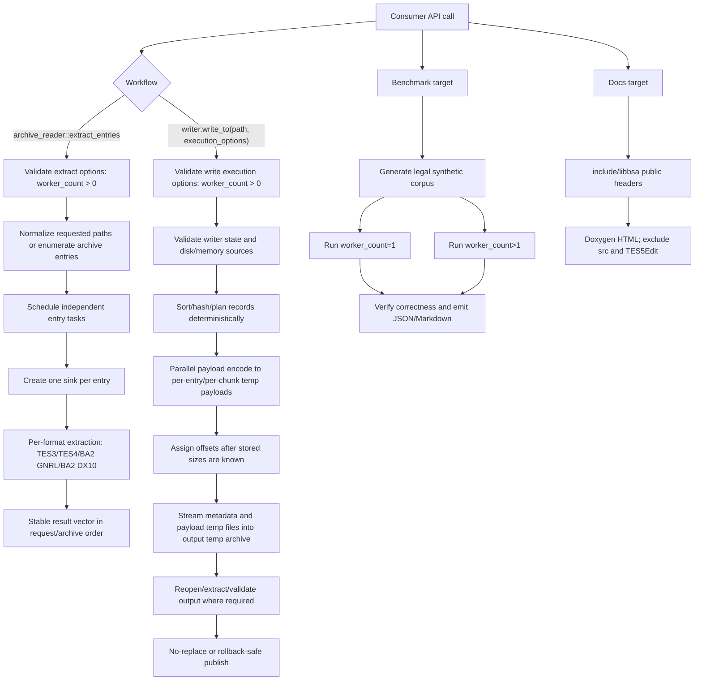

# Phase 12: performance-concurrency-documentation-and-polish - Research

**Researched:** 2026-05-10
**Domain:** C++20 archive-library performance, scoped concurrency, benchmark wiring, and public API documentation
**Confidence:** HIGH

<user_constraints>
## User Constraints (from CONTEXT.md)

The following locked constraints are copied from `12-CONTEXT.md`. [VERIFIED: .planning/phases/12-performance-concurrency-documentation-and-polish/12-CONTEXT.md]

### Locked Decisions

### Public Bulk Extraction Surface
- **D-01:** Add the public bulk extraction workflow as an `archive_reader` member, not as a separate top-level service. Expected shape is an `archive_reader::extract_entries`-style API with a small dependency-light options object.
- **D-02:** Bulk extraction accepts an explicit `worker_count` option that defaults to `1`. Single-threaded behavior remains the default; `worker_count > 1` is opt-in parallel extraction.
- **D-03:** Callers provide a per-entry sink factory or callback. The API should create or return a distinct sink per requested entry so parallel workers do not share one mutable sink.
- **D-04:** Bulk extraction returns stable per-entry result records in request/archive order, not completion order.
- **D-05:** If one entry fails, record that entry's typed error and continue extracting independent sibling entries. Do not fail the entire bulk workflow on the first per-entry error.
- **D-06:** Sink partial writes remain non-ambiguous errors. No bulk result may report success for an entry whose sink accepted only part of a chunk.

### Parallel Packing Controls
- **D-07:** Packing `worker_count` is supplied at `write_to` time through a finalization/execution options object rather than being stored in archive compatibility options.
- **D-08:** All public writers get the same write-call execution-options shape where meaningful: TES4-family BSA, TES3 BSA, BA2 GNRL, and BA2 DX10. TES3 has no compression path, so it may validate or effectively ignore parallelism while preserving the uniform public call shape.
- **D-09:** `worker_count` is an explicit positive count. `1` means serial, values greater than `1` opt into parallel work, and `0` is invalid rather than "auto".
- **D-10:** Parallel packing must preserve byte-stable output wherever earlier writer phases already required byte-stable output. Where earlier phases required semantic compatibility rather than exact bytes, parallel output must reopen, validate, and extract to equivalent metadata/payloads.
- **D-11:** Parallel packing must preserve existing safe-publish and rollback semantics. Compression, missing-source, validation, or publish failures in parallel mode must return stable `result` errors without leaving partial or corrupted destination archives.

### Bounded-Memory Proof
- **D-12:** Extraction memory proof should use behavior tests plus policy/source checks, not fragile process RSS gates.
- **D-13:** Raw extraction tests should use large legal synthetic archives and counting sinks to prove raw TES3, TES4-family, BA2 GNRL, and BA2 DX10 paths write through bounded chunks rather than whole-entry or whole-archive buffers.
- **D-14:** Compressed extraction may allocate codec-required per-entry or per-texture-chunk stored/decoded buffers. Document and test that boundary explicitly; do not require streaming codec rewrites in Phase 12.
- **D-15:** Oversized archive-controlled stored, decoded, entry, or chunk sizes must continue to fail through `libbsa::result` errors before unsafe allocation.
- **D-16:** Disk-backed writer finalization should publish through streaming temp-file writers for records and payloads. Policy checks should reject reintroducing a final whole-archive byte vector for disk-backed TES3, TES4-family, BA2 GNRL, or BA2 DX10 flows.
- **D-17:** Large disk-backed writer regression tests should cover TES3, TES4-family, BA2 GNRL, and BA2 DX10. They should prove output by reopening and extracting/validating rather than relying only on implementation inspection.
- **D-18:** Memory entries keep their existing copied-at-add-time semantics. The bounded writer guarantee focuses on disk-backed large inputs; public docs should state that `add_bytes` intentionally copies caller memory.

### Benchmarks And Documentation
- **D-19:** Add a CMake benchmark target that generates legal synthetic data, runs equivalent worker-count `1` and `>1` packing/extraction scenarios, verifies output correctness, and emits a repeatable JSON and/or Markdown report.
- **D-20:** Benchmarks are buildable and policy-checked but not run by default CI or default CTest. CI may verify the target, wiring, and correctness hooks without gating on speed or long runtime.
- **D-21:** Add a Doxygen-only API documentation target/config for public headers. Exclude private implementation details and `TES5Edit/`; validation should run when Doxygen is available without adding a runtime dependency.
- **D-22:** Add compile-checked consumer examples for opening/listing/extracting archives, bulk extraction, creating each writer family, handling `result` errors, and validation. Prefer package-consumer/docs test wiring over narrative-only snippets.
- **D-23:** Add machine-checked thread-safety guidance for public readers, writers, entry metadata, callbacks, sinks, validation APIs, benchmark helpers, and new bulk/parallel types.
- **D-24:** Add target-format guidance that covers TES3 BSA, TES4-family BSA v103/v104/v105, Fallout 4 BA2 GNRL/DX10, Starfield BA2 v2/v3 GNRL, Starfield BA2 v3 DX10, deflate, LZ4 frame, raw LZ4 block, writer target policies, and public compatibility warning codes.

### Carry-Forward Decisions
- **D-25:** Preserve dependency-light C++20 public headers: no public `std::expected`, libdeflate, lz4, DirectXTex, Windows SDK, TES5Edit, private parser, private writer, private hash, or private compression types.
- **D-26:** Preserve generated/legal fixture policy. Mandatory evidence uses synthetic in-repo data; optional local game or BSArchPro-derived checks stay skipped by default and must not gate acceptance.
- **D-27:** Preserve `TES5Edit/` as read-only reference material. Do not edit, format, compile into libbsa, stage, or use it as a fixture workspace.
- **D-28:** Preserve existing writer and validation public-error contracts. Tests should assert stable error codes and result shapes, not exact diagnostic text.

### the agent's Discretion
- Researcher/planner may choose exact public type names for bulk extraction requests/results, sink factory signatures, and writer execution options if the API remains C++20, dependency-light, deterministic, and close to the existing reader/writer style.
- Researcher/planner may choose the internal worker implementation strategy, scheduling order, and task decomposition, provided public ordering, typed errors, no-partial-sink behavior, and safe-publish semantics are preserved.
- Researcher/planner may choose exact benchmark executable names, target names, report schema, and generated synthetic corpus sizes if correctness is checked and no fixed speedup threshold is used.
- Researcher/planner may choose exact Doxygen target/config names and documentation policy-test mechanics if only public headers are documented and private/TES5Edit surfaces remain excluded.

### Deferred Ideas (OUT OF SCOPE)

None - discussion stayed within phase scope.
</user_constraints>

<phase_requirements>
## Phase Requirements

| ID | Description | Research Support |
|----|-------------|------------------|
| PERF-01 | Consumer can extract large archives using streaming I/O and bounded scratch buffers. | Existing raw readers use 64 KiB chunks; Phase 12 should add cross-family large-fixture/counting-sink tests and policy checks for no whole-archive extraction. [VERIFIED: .planning/REQUIREMENTS.md; VERIFIED: src/formats/bsa/tes3_bsa_reader.cpp; VERIFIED: src/formats/bsa/tes4_bsa_reader.cpp; VERIFIED: src/formats/ba2/ba2_gnrl_reader.cpp; VERIFIED: src/formats/ba2/ba2_dx10_reader.cpp] |
| PERF-02 | Consumer can pack large archives using streaming writer flows and bounded scratch buffers. | Current writer paths still read source/stored/final archive bytes into vectors before publishing; plan must refactor disk-backed writers to stream metadata and payload temp files. [VERIFIED: .planning/REQUIREMENTS.md; VERIFIED: src/formats/bsa/tes3_bsa_writer.cpp; VERIFIED: src/formats/bsa/tes4_bsa_writer.cpp; VERIFIED: src/formats/ba2/ba2_gnrl_writer.cpp; VERIFIED: src/formats/ba2/ba2_dx10_writer.cpp] |
| PERF-03 | Consumer can opt into parallel compression during packing after single-threaded correctness is established. | Add `write_execution_options{worker_count}` overloads on every public writer while retaining serial default overloads. [VERIFIED: .planning/REQUIREMENTS.md; VERIFIED: 12-CONTEXT.md; VERIFIED: include/libbsa/writer.hpp] |
| PERF-04 | Consumer can opt into parallel decompression during bulk extraction after single-threaded correctness is established. | Add `archive_reader::extract_entries` with `worker_count`, per-entry sink factory, deterministic result vector, and per-entry error records. [VERIFIED: .planning/REQUIREMENTS.md; VERIFIED: 12-CONTEXT.md; VERIFIED: include/libbsa/archive.hpp] |
| PERF-05 | Maintainer can run benchmarks comparing single-threaded and multi-threaded packing/extraction for large archives. | Use an explicit CMake benchmark target/executable that creates legal synthetic data, verifies outputs, and emits JSON/Markdown without default CTest speed gates. [VERIFIED: .planning/REQUIREMENTS.md; VERIFIED: 12-CONTEXT.md; CITED: raw.githubusercontent.com/google/benchmark/main/docs/user_guide.md] |
| PERF-06 | Consumer can understand documented thread-safety guarantees for readers, writers, entries, callbacks, and sinks. | Add canonical thread-safety docs and policy tests requiring each public reader/writer/validation/bulk type to reference the thread-safety section. [VERIFIED: .planning/REQUIREMENTS.md; VERIFIED: 12-CONTEXT.md; CITED: isocpp.github.io/CppCoreGuidelines/CppCoreGuidelines] |
| DOC-01 | Consumer can read Doxygen-generated public API documentation for supported archive operations. | Add `FindDoxygen`/`doxygen_add_docs` target for `include/libbsa` only; exclude private implementation and `TES5Edit/`. [VERIFIED: .planning/REQUIREMENTS.md; CITED: cmake.org/cmake/help/latest/module/FindDoxygen.html; CITED: doxygen.nl/manual/config.html] |
| DOC-02 | Consumer can follow integration examples for opening archives, listing files, extracting files, creating archives, and handling errors. | Extend package-consumer/docs examples so snippets compile against installed `libbsa::libbsa`. [VERIFIED: .planning/REQUIREMENTS.md; VERIFIED: tests/package-consumer/main.cpp; VERIFIED: tests/package-consumer/smoke.cmake] |
| DOC-03 | Consumer can read target-format guidance that explains supported variants, compression methods, and known compatibility warnings. | Add a target-format guide cross-linked to `docs/compatibility-evidence.md` and include all supported BSA/BA2 variants plus warning codes. [VERIFIED: .planning/REQUIREMENTS.md; VERIFIED: docs/compatibility-evidence.md; VERIFIED: docs/PRD.md] |
</phase_requirements>

## Summary

Phase 12 should be planned as a public API extension plus internal writer/extraction proof pass, not as a new product layer. [VERIFIED: 12-SPEC.md; VERIFIED: 12-CONTEXT.md] The existing reader facade, writer facades, `payload_sink`, validation policy tests, generated legal fixture policy, and package-consumer smoke path are the right integration points. [VERIFIED: include/libbsa/archive.hpp; VERIFIED: include/libbsa/writer.hpp; VERIFIED: src/detail/payload_stream.cpp; VERIFIED: tests/unit/validation_policy_tests.cpp; VERIFIED: tests/package-consumer/main.cpp]

The largest implementation risk is writer memory behavior. [VERIFIED: source inspection] TES3, TES4-family, BA2 GNRL, and BA2 DX10 writer finalization currently materialize source payloads, stored payloads, or final archive bytes in `std::vector<std::byte>` before writing output. [VERIFIED: src/formats/bsa/tes3_bsa_writer.cpp; VERIFIED: src/formats/bsa/tes4_bsa_writer.cpp; VERIFIED: src/formats/ba2/ba2_gnrl_writer.cpp; VERIFIED: src/formats/ba2/ba2_dx10_writer.cpp] Plan the writer refactor around deterministic preparation records plus per-payload temp files, then stream the final temp archive in sorted archive order and publish only after validation succeeds. [VERIFIED: 12-CONTEXT.md; VERIFIED: codebase writer paths]

**Primary recommendation:** Use dependency-light C++20 public options and a scoped per-call worker helper; spool compressed/stored payloads to temp files, preserve deterministic offset assignment, and prove behavior with generated legal large fixtures, policy tests, compile-checked examples, and optional Doxygen/benchmark targets. [VERIFIED: 12-CONTEXT.md; VERIFIED: AGENTS.md; CITED: learn.microsoft.com/cpp/overview/visual-cpp-language-conformance; CITED: cmake.org/cmake/help/latest/module/FindDoxygen.html]

## Project Constraints (from AGENTS.md)

- Implementation work must remain outside `TES5Edit/`, and the submodule must not be edited, formatted, staged, compiled into libbsa, used as a fixture workspace, or have its pointer moved. [VERIFIED: AGENTS.md]
- The project is a reusable C++20 Bethesda archive library, not a GUI, CLI product, or direct Delphi/Pascal transliteration. [VERIFIED: AGENTS.md; VERIFIED: .planning/PROJECT.md]
- Public headers must stay dependency-light and avoid leaking libdeflate, lz4, DirectXTex, Windows SDK, TES5Edit, private parser, private writer, private hash, and private compression types. [VERIFIED: AGENTS.md; VERIFIED: .planning/PROJECT.md]
- Required dependencies are libdeflate, official lz4, DirectXTex, vcpkg, CMake, Catch2, and CTest; new dependencies need documented justification and project impact. [VERIFIED: AGENTS.md; VERIFIED: vcpkg.json]
- Public APIs use the local C++20 `libbsa::result<T>` / error-code model for I/O and format failures, not public C++23 `std::expected`. [VERIFIED: AGENTS.md; VERIFIED: include/libbsa/result.hpp]
- Public APIs and substantially rewritten methods need Doxygen-compliant comments; accurate comments must not be deleted as cleanup. [VERIFIED: AGENTS.md]
- Tests should be focused on archive parsing, writing, round-tripping, and compatibility behavior with generated legal fixtures. [VERIFIED: AGENTS.md; VERIFIED: tests/fixtures/README.md]
- GSD workflow says repo edits should stay under phase workflow; this research writes only the required phase artifact. [VERIFIED: AGENTS.md; VERIFIED: gsd-sdk init.phase-op 12]

## Architectural Responsibility Map

| Capability | Primary Tier | Secondary Tier | Rationale |
|------------|--------------|----------------|-----------|
| Bulk extraction API | Public C++ API | Reader implementation | The caller-facing contract belongs on `archive_reader`; per-format readers own actual extraction dispatch. [VERIFIED: 12-CONTEXT.md; VERIFIED: include/libbsa/archive.hpp] |
| Parallel decompression | Reader implementation | Private codec adapters | Workers schedule independent entries/chunks; codec selection remains private and routed by parsed metadata. [VERIFIED: src/archive.cpp; VERIFIED: src/detail/compression_router.hpp] |
| Bounded raw extraction | Format reader implementation | Test/policy harness | Raw readers already stream fixed chunks; Phase 12 should prove this across all supported families. [VERIFIED: src/formats/bsa/tes3_bsa_reader.cpp; VERIFIED: src/formats/bsa/tes4_bsa_reader.cpp; VERIFIED: src/formats/ba2/ba2_gnrl_reader.cpp; VERIFIED: src/formats/ba2/ba2_dx10_reader.cpp] |
| Writer execution options | Public C++ API | Writer implementation | `worker_count` must be supplied at `write_to` time and shared across writer families. [VERIFIED: 12-CONTEXT.md; VERIFIED: include/libbsa/writer.hpp] |
| Parallel packing | Writer implementation | Private codec adapters | Compression can run per payload/chunk, but metadata sorting, offset assignment, and final output order must remain deterministic. [VERIFIED: 12-CONTEXT.md; VERIFIED: writer source inspection] |
| Safe publish / rollback | Writer implementation | Filesystem helper layer | Publish behavior is observable API behavior and must be preserved or tightened during streaming refactors. [VERIFIED: 12-CONTEXT.md; VERIFIED: src/detail/atomic_file_ops.hpp; VERIFIED: src/formats/ba2/ba2_publish.hpp] |
| Benchmarks | Build/test tooling | Generated fixture utilities | The benchmark target is maintainer tooling, not part of public runtime API or default CTest. [VERIFIED: 12-CONTEXT.md; VERIFIED: CMakeLists.txt; VERIFIED: tests/CMakeLists.txt] |
| Doxygen API docs | Build/docs tooling | Public headers | Documentation generation should consume `include/libbsa` and docs markdown, excluding private `src/` and `TES5Edit/`. [VERIFIED: 12-CONTEXT.md; CITED: cmake.org/cmake/help/latest/module/FindDoxygen.html; CITED: doxygen.nl/manual/config.html] |

## Standard Stack

### Core

| Library / Tool | Version | Purpose | Why Standard |
|----------------|---------|---------|--------------|
| C++ standard library concurrency | C++20; MSVC has `<stop_token>` and `std::jthread` support from VS 2019 16.9 | Scoped workers, positive worker-count validation, result aggregation | Keeps public/runtime dependencies unchanged and matches the C++20 constraint. [CITED: learn.microsoft.com/cpp/overview/visual-cpp-language-conformance; VERIFIED: AGENTS.md] |
| CMake | Minimum 3.24 in repo; local tool is 4.3.2 | Add benchmark/docs targets, presets, and optional docs checks | Repo already uses CMake presets and install/export package targets. [VERIFIED: CMakeLists.txt; VERIFIED: CMakePresets.json; VERIFIED: environment probe] |
| CTest | Local tool is 4.3.2 | Test orchestration, non-default benchmark/docs policy gates | Existing test suite is Catch2-discovered through CTest labels. [VERIFIED: tests/CMakeLists.txt; VERIFIED: environment probe] |
| libdeflate | vcpkg registry reports 1.25 | Deflate compression/decompression for BSA/BA2 routes | Existing project dependency; do not replace or expose publicly. [VERIFIED: vcpkg x-package-info libdeflate; VERIFIED: vcpkg.json] |
| lz4 | vcpkg registry reports 1.10.0 | LZ4 frame/raw-block compression/decompression | Existing project dependency; frame-vs-block route remains private. [VERIFIED: vcpkg x-package-info lz4; VERIFIED: vcpkg.json] |
| DirectXTex | vcpkg registry reports 2026-03-31 | DDS source analysis/metadata validation for BA2 DX10 | Existing private texture-analysis boundary; keep out of public headers. [VERIFIED: vcpkg x-package-info directxtex; VERIFIED: src/texture/directxtex_analyzer.hpp] |

### Supporting

| Library / Tool | Version | Purpose | When to Use |
|----------------|---------|---------|-------------|
| Catch2 | vcpkg registry reports 3.14.0 | Unit, fixture, public-boundary, policy, and package-consumer tests | Use for all Phase 12 regression tests; keep benchmark execution separate from default CTest. [VERIFIED: vcpkg x-package-info catch2; CITED: catch2-temp.readthedocs.io/en/latest/cmake-integration.html] |
| nlohmann-json | vcpkg registry reports 3.12.0#2 | Test manifests and benchmark report validation | Already used by tests; acceptable for benchmark JSON policy checks. [VERIFIED: vcpkg x-package-info nlohmann-json; VERIFIED: tests/CMakeLists.txt] |
| Python 3 | Local `python` is 3.14.4 | Existing fixture manifest validation and possible benchmark report schema check | Use for report/schema validation scripts only, matching current test infrastructure. [VERIFIED: environment probe; VERIFIED: tests/fixtures/generated/validate_fixture_manifests.py] |
| Doxygen | Local CLI missing; official changelog lists 1.17.0 released 2026-04-30, while the fetched GitHub latest page still showed 1.15.0 | Optional public API documentation generation | Use `find_package(Doxygen QUIET)` and skip generation clearly when absent; do not pin a runtime dependency. [VERIFIED: environment probe; CITED: doxygen.nl/manual/changelog.html; CITED: github.com/doxygen/doxygen/releases/latest] |

### Alternatives Considered

| Instead of | Could Use | Tradeoff |
|------------|-----------|----------|
| Scoped standard-library worker helper | Google Benchmark / other concurrency framework | Google Benchmark is useful for benchmark reporting and supports JSON output, but it is not needed for production scheduling and would add a new dev dependency. [VERIFIED: vcpkg x-package-info benchmark; CITED: raw.githubusercontent.com/google/benchmark/main/docs/user_guide.md; VERIFIED: AGENTS.md] |
| Custom scenario benchmark executable | Google Benchmark executable | Google Benchmark offers JSON output and statistical runs, but archive pack/extract benchmarks are heavyweight filesystem workflows with correctness setup/cleanup; a deterministic scenario runner better matches D-19/D-20. [CITED: raw.githubusercontent.com/google/benchmark/main/docs/user_guide.md; VERIFIED: 12-CONTEXT.md] |
| Doxygen via CMake `FindDoxygen` | Sphinx+Breathe, custom markdown-only docs | CMake has first-party `doxygen_add_docs`; Sphinx/Breathe would add extra tooling beyond Phase 12's locked "Doxygen or equivalent" target. [CITED: cmake.org/cmake/help/latest/module/FindDoxygen.html; VERIFIED: 12-CONTEXT.md] |
| Policy/source checks for bounded memory | RSS/process memory gates | Phase 12 explicitly rejects fragile process RSS gates and locks behavior/policy checks instead. [VERIFIED: 12-CONTEXT.md] |

**Installation:**

```powershell
# Existing manifest dependencies are already in vcpkg.json.
# Do not add Google Benchmark unless the plan deliberately chooses it for benchmark reporting.
$env:VCPKG_ROOT = 'C:\vcpkg'
cmake --preset windows-msvc-debug-static
cmake --build --preset windows-msvc-debug-static
```

**Version verification:** Package versions above were verified with `C:\vcpkg\vcpkg.exe x-package-info ... --x-json`; the command returned registry data plus a warning that `vcpkg.json` and `vcpkg-configuration.json` both specify baseline sources, with `vcpkg-configuration.json` taking precedence. [VERIFIED: vcpkg x-package-info output; VERIFIED: vcpkg.json; VERIFIED: vcpkg-configuration.json]

## Architecture Patterns

### System Architecture Diagram



The primary workflow splits public API validation, deterministic metadata preparation, parallel payload work, serial deterministic assembly, correctness validation, and safe publish into separate stages. [VERIFIED: 12-CONTEXT.md; VERIFIED: writer source inspection]

### Recommended Project Structure

```text
include/libbsa/
├── archive.hpp          # add bulk extraction public types/member
├── writer.hpp           # add write_execution_options + write_to overloads
└── libbsa.hpp           # expose new public types

src/detail/
├── parallel_work.hpp    # scoped worker helper, no global pool
├── temp_payload.hpp     # temp-file backed stored payload descriptors
└── payload_stream.*     # reuse/extend bounded transfer helpers

src/formats/
├── bsa/*_writer.cpp     # stream disk-backed TES3/TES4 payloads and metadata
└── ba2/*_writer.cpp     # stream BA2 GNRL/DX10 payload temp files and filename tables

benchmarks/
├── libbsa_benchmarks.cpp
└── README.md

docs/
├── Doxyfile.in
├── api-mainpage.md
├── thread-safety.md
├── integration-examples.md
└── target-format-guide.md

tests/
├── unit/performance_policy_tests.cpp
├── unit/bulk_extraction_tests.cpp
├── unit/parallel_writer_tests.cpp
└── package-consumer/main.cpp
```

This structure keeps public API declarations in `include/libbsa`, private scheduling/spooling helpers under `src/detail`, workflow tests under `tests/unit`, and maintainer-only benchmark/docs tooling outside the library target. [VERIFIED: codebase layout; VERIFIED: AGENTS.md]

### Pattern 1: Public Bulk Extraction As Reader Member

**What:** Add dependency-light public request/options/result/factory types and an `archive_reader::extract_entries` member. [VERIFIED: 12-CONTEXT.md]

**When to use:** Use for multi-entry extraction, deterministic per-entry error collection, and opt-in parallel decompression. [VERIFIED: 12-SPEC.md]

**Example:**

```cpp
// Source: Phase 12 locked decisions + existing payload_sink pattern.
struct extract_entries_options {
  std::uint32_t worker_count{1};
};

class extract_sink_factory {
 public:
  virtual ~extract_sink_factory() = default;
  virtual result<std::unique_ptr<payload_sink>> open(const entry_metadata& entry) = 0;
};

struct extract_entry_result {
  entry_metadata entry;
  std::optional<error> failure;
};

[[nodiscard]] result<std::vector<extract_entry_result>>
archive_reader::extract_entries(std::span<const std::string_view> paths,
                                extract_sink_factory& sinks,
                                extract_entries_options options) const;
```

Use a pure virtual factory if the planner wants to mirror the existing `payload_sink` style and avoid `std::function` callback exception ambiguity in the public contract. [VERIFIED: include/libbsa/archive.hpp; VERIFIED: include/libbsa/result.hpp]

### Pattern 2: Write-Time Execution Options

**What:** Add a shared `write_execution_options` type and overload every public writer `write_to`. [VERIFIED: 12-CONTEXT.md; VERIFIED: include/libbsa/writer.hpp]

**When to use:** Use for `worker_count` and future execution-only knobs; do not mix this into archive compatibility options. [VERIFIED: 12-CONTEXT.md]

**Example:**

```cpp
// Source: Phase 12 D-07 through D-09.
struct write_execution_options {
  std::uint32_t worker_count{1};
};

result<void> tes4_bsa_writer::write_to(std::string_view host_path) const {
  return write_to(host_path, write_execution_options{});
}

result<void> tes4_bsa_writer::write_to(std::string_view host_path,
                                       write_execution_options execution) const;
```

`worker_count == 0` must fail with `error_code::invalid_argument`, and `worker_count == 1` must preserve the existing serial behavior. [VERIFIED: 12-CONTEXT.md; VERIFIED: include/libbsa/result.hpp]

### Pattern 3: Scoped Parallel Work Helper

**What:** Use a per-call worker helper that owns all threads and joins before the public API returns. [CITED: learn.microsoft.com/cpp/overview/visual-cpp-language-conformance; CITED: isocpp.github.io/CppCoreGuidelines/CppCoreGuidelines]

**When to use:** Use for independent entry/chunk operations where each task writes to its own result slot and owns its own sink/temp payload. [VERIFIED: 12-CONTEXT.md]

**Example:**

```cpp
// Source: C++20 std::jthread availability + Phase 12 deterministic-result rule.
std::atomic_size_t next{0};
std::vector<std::jthread> workers;
workers.reserve(worker_count);

for (std::uint32_t i = 0; i < worker_count; ++i) {
  workers.emplace_back([&] {
    for (;;) {
      const auto index = next.fetch_add(1, std::memory_order_relaxed);
      if (index >= jobs.size()) {
        break;
      }
      results[index] = run_one_job(jobs[index]);
    }
  });
}
```

Do not hold a library mutex while invoking caller-owned sink factories, sink writes, or callbacks, because unknown callback code can deadlock or stall unrelated work. [CITED: isocpp.github.io/CppCoreGuidelines/CppCoreGuidelines]

### Pattern 4: Temp-File Payload Spooling For Writers

**What:** Parallel workers should produce deterministic payload descriptors containing final stored size, raw size, compression route, and a temp-file path for owned stored bytes. [VERIFIED: 12-SPEC.md; VERIFIED: writer source inspection]

**When to use:** Use for disk-backed compressed entries, BA2 DX10 chunks, and dedupe candidates where final stored bytes are needed before offsets can be assigned. [VERIFIED: 12-CONTEXT.md; VERIFIED: src/formats/ba2/ba2_dx10_writer.cpp]

**Example:**

```cpp
// Source: Phase 12 bounded writer decisions + current writer vector bottleneck.
struct staged_payload {
  std::uint64_t raw_size{};
  std::uint64_t stored_size{};
  entry_compression compression{entry_compression::none};
  std::filesystem::path temp_payload_path;
  bool owns_payload{true};
};
```

Assign archive offsets only after all staged payload sizes are known, then stream metadata and staged payload files in the already sorted writer order. [VERIFIED: 12-CONTEXT.md; VERIFIED: writer source inspection]

### Pattern 5: Doxygen Target Through CMake

**What:** Add an optional docs target with `find_package(Doxygen QUIET)` and `doxygen_add_docs`. [CITED: cmake.org/cmake/help/latest/module/FindDoxygen.html]

**When to use:** Use when Doxygen is installed; otherwise configure should remain clear and non-fragile. [VERIFIED: environment probe; VERIFIED: 12-CONTEXT.md]

**Example:**

```cmake
# Source: CMake FindDoxygen documentation.
find_package(Doxygen QUIET)
if(Doxygen_FOUND)
  set(DOXYGEN_OUTPUT_DIRECTORY "${CMAKE_CURRENT_BINARY_DIR}/docs/api")
  set(DOXYGEN_EXCLUDE_PATTERNS "*/src/*" "*/TES5Edit/*" "*/tests/*")
  doxygen_add_docs(libbsa_api_docs
    "${PROJECT_SOURCE_DIR}/include/libbsa"
    "${PROJECT_SOURCE_DIR}/docs/api-mainpage.md"
  )
endif()
```

Doxygen supports `INPUT`, `EXCLUDE`, `EXCLUDE_PATTERNS`, and warning-related configuration tags, so keep the docs target explicitly scoped to public headers and docs pages. [CITED: doxygen.nl/manual/config.html]

### Anti-Patterns to Avoid

- **Global thread pool:** A process-wide singleton or daemon worker pool conflicts with the no-global-mutable-state project model. Use scoped per-call workers. [VERIFIED: AGENTS.md; CITED: isocpp.github.io/CppCoreGuidelines/CppCoreGuidelines]
- **Shared mutable sink:** Sharing one caller-owned sink across workers makes thread safety ambiguous. Use one sink per entry. [VERIFIED: 12-CONTEXT.md]
- **Completion-order results:** Returning results as tasks finish violates deterministic reporting. Pre-size result records and write by request/archive index. [VERIFIED: 12-CONTEXT.md]
- **Hash-only dedupe:** Existing dedupe compares final stored bytes; streaming dedupe may use hashes only as candidates and must confirm byte equality. [VERIFIED: src/formats/bsa/tes4_bsa_writer.cpp; VERIFIED: src/formats/ba2/ba2_gnrl_writer.cpp; VERIFIED: src/formats/ba2/ba2_dx10_writer.cpp]
- **Whole-archive publish vector:** `detail::binary_writer::bytes()` followed by one output write is the main pattern Phase 12 must remove from disk-backed writer flows. [VERIFIED: writer source inspection]
- **Default benchmark CI runtime:** Benchmarks must be buildable and policy-checked, but not executed by default CTest/CI with speed thresholds. [VERIFIED: 12-CONTEXT.md]

## Don't Hand-Roll

| Problem | Don't Build | Use Instead | Why |
|---------|-------------|-------------|-----|
| Production scheduling | Process-wide thread pool, detached threads, lock-free queue | Scoped per-call worker helper using C++20 standard threads/jthreads | Preserves no-global-state, deterministic join, and simple failure aggregation. [VERIFIED: AGENTS.md; CITED: learn.microsoft.com/cpp/overview/visual-cpp-language-conformance] |
| Caller sink coordination | Shared synchronized sink wrapper | Per-entry sink factory with one sink per entry | Avoids hidden thread-safety promises for caller-owned objects. [VERIFIED: 12-CONTEXT.md] |
| Compression algorithms | Custom deflate/LZ4 streaming codecs | Existing private `compression_router` and codec adapters | Phase 12 permits per-entry/per-chunk codec buffers and does not require codec rewrites. [VERIFIED: 12-CONTEXT.md; VERIFIED: src/detail/compression_router.cpp] |
| DDS parsing/transformation | New DDS parser or image transformer | Existing DirectXTex-backed analyzer and existing DX10 no-transform semantics | Phase 12 excludes resizing, transcoding, mip generation, repair, or image transformation. [VERIFIED: 12-SPEC.md; VERIFIED: src/formats/ba2/ba2_dx10_writer.cpp] |
| Documentation extraction | Custom C++ header parser | Doxygen through CMake `FindDoxygen` | Doxygen is the locked docs direction and CMake has first-party integration. [VERIFIED: 12-CONTEXT.md; CITED: cmake.org/cmake/help/latest/module/FindDoxygen.html] |
| Memory proof | Process RSS assertions | Counting sinks, synthetic fixtures, and policy/source checks | Phase 12 explicitly rejects fixed RSS gates. [VERIFIED: 12-CONTEXT.md] |
| Benchmark speed gate | CI threshold such as "parallel must be 2x faster" | Correctness-checked JSON/Markdown report | Performance varies by host; Phase 12 requires reportability, not threshold gating. [VERIFIED: 12-CONTEXT.md] |

**Key insight:** The phase is about bounded workflow structure and deterministic public contracts, not chasing a universal memory number or speedup threshold. [VERIFIED: 12-SPEC.md]

## Common Pitfalls

### Pitfall 1: Breaking Existing Writer Semantics While Fixing Memory

**What goes wrong:** BA2 DX10 currently validates and snapshots DDS source bytes at `add_file` time; changing it to late path reads would make later source mutation affect output. [VERIFIED: include/libbsa/writer.hpp; VERIFIED: src/formats/ba2/ba2_dx10_writer.cpp]
**Why it happens:** Bounded-memory work tempts the implementer to replace stored source bytes with just a host path. [VERIFIED: source inspection]
**How to avoid:** Preserve add-time ownership with writer-owned scratch files or a documented bounded exception; do not silently change add-time validation/source lifetime contracts. [VERIFIED: 12-CONTEXT.md; VERIFIED: include/libbsa/writer.hpp]
**Warning signs:** Tests that mutate/delete a DDS source after `add_file` start failing or disappear. [VERIFIED: src/formats/ba2/ba2_dx10_writer.cpp]

### Pitfall 2: Parallel Output Becomes Nondeterministic

**What goes wrong:** Compression tasks complete in variable order and offsets/dedupe mappings follow completion order. [VERIFIED: 12-CONTEXT.md]
**Why it happens:** Payload generation and archive assembly are not separated. [VERIFIED: writer source inspection]
**How to avoid:** Stage payloads in parallel, then assign offsets and write records/payloads serially in deterministic sorted order. [VERIFIED: 12-CONTEXT.md]
**Warning signs:** Worker count `1` and `>1` reopen correctly but byte-stable writer tests drift for formats that previously required byte stability. [VERIFIED: 12-CONTEXT.md]

### Pitfall 3: Partial Sink Writes Report Success In Bulk Mode

**What goes wrong:** A bulk result marks an entry successful even though its sink accepted fewer bytes than offered. [VERIFIED: 12-CONTEXT.md]
**Why it happens:** New bulk code bypasses existing `write_all`/`transfer_payload` partial-write checks. [VERIFIED: src/detail/payload_stream.cpp; VERIFIED: reader source inspection]
**How to avoid:** Route all extraction writes through the same partial-write policy and store `io_error` in that entry's result record. [VERIFIED: 12-CONTEXT.md; VERIFIED: src/detail/payload_stream.cpp]
**Warning signs:** A custom test sink that returns `bytes.size() - 1` does not fail the specific entry. [VERIFIED: 12-CONTEXT.md]

### Pitfall 4: Callback Deadlock Under Internal Locks

**What goes wrong:** A caller callback or sink factory calls back into libbsa while an internal lock is held and deadlocks. [CITED: isocpp.github.io/CppCoreGuidelines/CppCoreGuidelines]
**Why it happens:** Worker code protects result vectors or queues with a broad mutex and invokes unknown callback code inside the critical section. [CITED: isocpp.github.io/CppCoreGuidelines/CppCoreGuidelines]
**How to avoid:** Use pre-sized result slots, atomic indices, and local values; invoke caller code outside locks. [CITED: isocpp.github.io/CppCoreGuidelines/CppCoreGuidelines]
**Warning signs:** Tests with re-entrant sink factories hang only when `worker_count > 1`. [VERIFIED: 12-CONTEXT.md]

### Pitfall 5: Docs Target Becomes A Required Local Dependency

**What goes wrong:** Configure or default build fails on machines without Doxygen. [VERIFIED: environment probe]
**Why it happens:** `find_package(Doxygen REQUIRED)` is added unconditionally. [CITED: cmake.org/cmake/help/latest/module/FindDoxygen.html]
**How to avoid:** Use `find_package(Doxygen QUIET)`, add the docs target only when available, and policy-check CMake/docs config text separately. [VERIFIED: 12-CONTEXT.md; CITED: cmake.org/cmake/help/latest/module/FindDoxygen.html]
**Warning signs:** Local `cmake --preset windows-msvc-debug-static` fails because `doxygen` is not in PATH. [VERIFIED: environment probe]

## Code Examples

Verified patterns from project and official sources.

### Public Error Record Instead Of Throwing From Bulk

```cpp
// Source: include/libbsa/result.hpp and Phase 12 D-05.
struct extract_entry_result {
  entry_metadata entry;
  std::optional<error> failure;

  [[nodiscard]] bool succeeded() const noexcept { return !failure.has_value(); }
};
```

Bulk extraction should return a `result<std::vector<extract_entry_result>>`; setup errors fail the outer result, while independent per-entry extraction failures stay in records. [VERIFIED: include/libbsa/result.hpp; VERIFIED: 12-CONTEXT.md]

### Worker Count Validation

```cpp
// Source: Phase 12 D-09.
result<void> validate_worker_count(std::uint32_t worker_count) {
  if (worker_count == 0U) {
    return error{error_code::invalid_argument, "worker_count must be greater than zero"};
  }
  return {};
}
```

Do not interpret `0` as "auto"; this prevents accidental oversubscription inside host applications. [VERIFIED: 12-CONTEXT.md]

### Benchmark Target Shape

```cmake
# Source: current CMake layout + Phase 12 D-19/D-20.
option(LIBBSA_BUILD_BENCHMARKS "Build libbsa benchmark tools" ON)

if(LIBBSA_BUILD_BENCHMARKS)
  add_executable(libbsa_benchmarks benchmarks/libbsa_benchmarks.cpp)
  target_link_libraries(libbsa_benchmarks PRIVATE libbsa::libbsa nlohmann_json::nlohmann_json)
  add_custom_target(libbsa_benchmark_report
    COMMAND libbsa_benchmarks
      --output-json "${CMAKE_BINARY_DIR}/benchmarks/libbsa-benchmark.json"
      --output-markdown "${CMAKE_BINARY_DIR}/benchmarks/libbsa-benchmark.md"
    DEPENDS libbsa_benchmarks
    VERBATIM)
endif()
```

Keep report generation explicit and outside default CTest; add policy tests that the target and README exist. [VERIFIED: 12-CONTEXT.md; CITED: cmake.org/cmake/help/latest/command/add_custom_target.html]

### Doxygen Public-Header Config Inputs

```text
# Source: Doxygen configuration manual.
INPUT = include/libbsa docs/api-mainpage.md docs/thread-safety.md docs/target-format-guide.md
RECURSIVE = YES
EXCLUDE = src TES5Edit tests build out vcpkg_installed
EXCLUDE_PATTERNS = */src/* */TES5Edit/* */tests/*
GENERATE_HTML = YES
GENERATE_LATEX = NO
WARN_IF_UNDOCUMENTED = YES
WARN_AS_ERROR = NO
```

Set warning behavior intentionally; a missing local Doxygen CLI should not block normal builds, but a docs validation command should be runnable when Doxygen is available. [CITED: doxygen.nl/manual/config.html; VERIFIED: environment probe]

## State of the Art

| Old Approach | Current Approach | When Changed | Impact |
|--------------|------------------|--------------|--------|
| Public `std::expected` in C++20 APIs | Local `libbsa::result<T>` | Project foundation | Phase 12 public result records should reuse the local result/error model. [VERIFIED: include/libbsa/result.hpp; VERIFIED: AGENTS.md] |
| Global mutable state for performance helpers | Isolated object state plus scoped call-level workers | Project constraint | Avoid singleton pools or global benchmark state in library code. [VERIFIED: AGENTS.md] |
| Writer builds final archive in memory | Phase 12 target is streaming temp-file assembly | Phase 12 SPEC | Refactor writer finalization before claiming PERF-02. [VERIFIED: 12-SPEC.md; VERIFIED: writer source inspection] |
| Fixed RSS thresholds | Structural bounded-memory proof | Phase 12 decisions | Use counting sinks, generated large data, and policy/source checks. [VERIFIED: 12-CONTEXT.md] |
| Doxygen as manually run local tool only | Optional CMake docs target with public-header scope | Phase 12 decisions | Add build-system discoverability without runtime dependency. [VERIFIED: 12-CONTEXT.md; CITED: cmake.org/cmake/help/latest/module/FindDoxygen.html] |
| Narrative-only examples | Compile-checked package-consumer/docs examples | Phase 12 decisions | Prevent stale snippets as public API changes. [VERIFIED: 12-CONTEXT.md; VERIFIED: tests/package-consumer/main.cpp] |

**Deprecated/outdated:**
- `TES4` writer deterministic `<output>.tmp` cleanup/publish should not be copied into new streaming writers because other writers moved toward unique temp directories and no-replace/rollback-safe publish patterns. [VERIFIED: src/formats/bsa/tes4_bsa_writer.cpp; VERIFIED: src/formats/bsa/tes3_bsa_writer.cpp; VERIFIED: src/formats/ba2/ba2_gnrl_writer.cpp; VERIFIED: src/formats/ba2/ba2_dx10_writer.cpp]
- Whole-archive `detail::binary_writer writer; const auto bytes = writer.bytes(); output.write(...)` is the key pattern policy tests should reject for disk-backed writer publish flows. [VERIFIED: writer source inspection]

## Assumptions Log

| # | Claim | Section | Risk if Wrong |
|---|-------|---------|---------------|
| - | No `[ASSUMED]` claims are intentionally used. | All sections | Planner can proceed without an explicit user-confirmation gate for research claims. [VERIFIED: source-tag audit] |

## Open Questions

1. **How should BA2 DX10 preserve add-time DDS snapshot semantics under bounded memory?** [VERIFIED: include/libbsa/writer.hpp; VERIFIED: src/formats/ba2/ba2_dx10_writer.cpp]
   - What we know: Existing BA2 DX10 `add_file` reads and analyzes the whole DDS file at add time. [VERIFIED: src/formats/ba2/ba2_dx10_writer.cpp]
   - What's unclear: Whether the planner should implement writer-owned temp snapshot files or document a narrow DX10 exception. [VERIFIED: 12-SPEC.md]
   - Recommendation: Use writer-owned temp snapshot files or temp chunk payloads so source lifetime remains stable without keeping full DDS bytes in memory. [VERIFIED: 12-CONTEXT.md]

2. **Should CI install Doxygen or only policy-check docs wiring?** [VERIFIED: environment probe; VERIFIED: 12-CONTEXT.md]
   - What we know: Local `doxygen` is missing, and D-21 says validation should run when Doxygen is available without adding a runtime dependency. [VERIFIED: environment probe; VERIFIED: 12-CONTEXT.md]
   - What's unclear: Whether default CI should install Doxygen for the docs target. [VERIFIED: .github/workflows/ci.yml]
   - Recommendation: Make Doxygen generation optional locally, add source/policy tests by default, and add a non-default or CI-install docs check only if setup cost is acceptable. [CITED: cmake.org/cmake/help/latest/module/FindDoxygen.html]

3. **Doxygen latest-version source conflict needs no pin.** [CITED: doxygen.nl/manual/changelog.html; CITED: github.com/doxygen/doxygen/releases/latest]
   - What we know: Official changelog lists release 1.17.0 dated 2026-04-30, while the fetched GitHub latest page returned 1.15.0. [CITED: doxygen.nl/manual/changelog.html; CITED: github.com/doxygen/doxygen/releases/latest]
   - What's unclear: Which feed package managers will expose on this machine. [VERIFIED: environment probe]
   - Recommendation: Do not pin an exact Doxygen version in the plan; rely on `find_package(Doxygen QUIET)` and document the local installed version when available. [CITED: cmake.org/cmake/help/latest/module/FindDoxygen.html]

## Environment Availability

| Dependency | Required By | Available | Version | Fallback |
|------------|-------------|-----------|---------|----------|
| CMake | Configure/build/docs/benchmark targets | yes | 4.3.2 | Repo minimum is 3.24. [VERIFIED: environment probe; VERIFIED: CMakePresets.json] |
| CTest | Test execution | yes | 4.3.2 | None needed. [VERIFIED: environment probe] |
| vcpkg | Dependency acquisition | yes | 2026-04-08 program version | Use `C:\vcpkg\vcpkg.exe`; `VCPKG_ROOT` may need to be set for presets. [VERIFIED: environment probe; VERIFIED: CMakePresets.json] |
| Python | Manifest/report validation scripts | yes | 3.14.4 | Existing CMake finds `Python3::Interpreter`. [VERIFIED: environment probe; VERIFIED: tests/CMakeLists.txt] |
| Git | Policy checks and commit helper | yes | 2.54.0.windows.1 | None needed. [VERIFIED: environment probe] |
| Doxygen | API docs generation | no | - | Make docs target optional and policy-check config/source when missing. [VERIFIED: environment probe; CITED: cmake.org/cmake/help/latest/module/FindDoxygen.html] |
| MSVC `cl` in current shell | Windows preset build | no in current PATH | - | Run from a VS Developer prompt or let CMake locate Visual Studio generator if available. [VERIFIED: environment probe] |
| Ninja | Optional generator | no | - | Existing presets do not require Ninja explicitly. [VERIFIED: environment probe; VERIFIED: CMakePresets.json] |
| Google Benchmark | Optional benchmark library alternative | not a dependency | vcpkg registry reports 1.9.5 | Use custom scenario runner unless planner explicitly justifies adding `benchmark`. [VERIFIED: vcpkg x-package-info benchmark] |

**Missing dependencies with no fallback:**
- None for research. [VERIFIED: environment probe]

**Missing dependencies with fallback:**
- Doxygen is missing; use optional `FindDoxygen` target and default policy checks. [VERIFIED: environment probe]
- MSVC `cl` is missing from this shell PATH; execute validation from a Visual Studio developer environment if the planner needs local builds. [VERIFIED: environment probe]

## Validation Architecture

### Test Framework

| Property | Value |
|----------|-------|
| Framework | Catch2 3.14.0 via vcpkg + CTest 4.3.2. [VERIFIED: vcpkg x-package-info catch2; VERIFIED: environment probe] |
| Config file | `tests/CMakeLists.txt`, `CMakePresets.json`. [VERIFIED: tests/CMakeLists.txt; VERIFIED: CMakePresets.json] |
| Quick run command | `ctest --preset windows-msvc-debug-static -R "public_include_boundary|payload_stream|validation_policy|package_consumer_smoke" --output-on-failure`. [VERIFIED: tests/CMakeLists.txt; VERIFIED: CMakePresets.json] |
| Full suite command | `ctest --preset windows-msvc-debug-static --output-on-failure`. [VERIFIED: CMakePresets.json] |

### Phase Requirements -> Test Map

| Req ID | Behavior | Test Type | Automated Command | File Exists? |
|--------|----------|-----------|-------------------|--------------|
| PERF-01 | Raw extraction streams in bounded chunks and compressed extraction remains per-entry/per-chunk | unit/fixture/policy | `ctest --preset windows-msvc-debug-static -R "bounded_extraction|payload_stream" --output-on-failure` | No, Wave 0 should add tests. [VERIFIED: test scan] |
| PERF-02 | Disk-backed writer flows avoid final whole-archive byte vectors and reopen/extract output | unit/roundtrip/policy | `ctest --preset windows-msvc-debug-static -R "bounded_writer|performance_policy" --output-on-failure` | No, Wave 0 should add tests. [VERIFIED: test scan] |
| PERF-03 | Writer `worker_count` serial vs parallel correctness | unit/roundtrip | `ctest --preset windows-msvc-debug-static -R "parallel_writer" --output-on-failure` | No, Wave 0 should add tests. [VERIFIED: test scan] |
| PERF-04 | Bulk extraction worker count, deterministic result order, per-entry failures | unit/fixture | `ctest --preset windows-msvc-debug-static -R "bulk_extraction" --output-on-failure` | No, Wave 0 should add tests. [VERIFIED: test scan] |
| PERF-05 | Benchmark target exists, correctness hooks/report schema present, not default CTest speed gate | policy/smoke | `ctest --preset windows-msvc-debug-static -R "benchmark_policy" --output-on-failure` | No, Wave 0 should add tests. [VERIFIED: test scan] |
| PERF-06 | Thread-safety docs cover all public reader/writer/sink/validation/bulk types | policy/docs | `ctest --preset windows-msvc-debug-static -R "thread_safety_policy" --output-on-failure` | No, Wave 0 should add tests. [VERIFIED: test scan] |
| DOC-01 | Doxygen target/config covers public headers and excludes private/TES5Edit | policy/docs | `ctest --preset windows-msvc-debug-static -R "docs_policy" --output-on-failure` | No, Wave 0 should add tests. [VERIFIED: test scan] |
| DOC-02 | Consumer examples compile through package-consumer path | package-consumer | `ctest --preset windows-msvc-debug-static -R "package_consumer_smoke" --output-on-failure` | Existing smoke exists; needs Phase 12 coverage expansion. [VERIFIED: tests/package-consumer/main.cpp] |
| DOC-03 | Target-format guide covers all variants/compression/warnings | policy/docs | `ctest --preset windows-msvc-debug-static -R "target_format_policy" --output-on-failure` | No, Wave 0 should add tests. [VERIFIED: test scan] |

### Sampling Rate

- **Per task commit:** Run the focused new test target for that task plus `public_include_boundary` when public headers change. [VERIFIED: tests/unit/public_include_boundary_tests.cpp]
- **Per wave merge:** Run `ctest --preset windows-msvc-debug-static -R "public_include_boundary|payload_stream|validation_policy|package_consumer_smoke|bulk_extraction|parallel_writer|bounded_writer|docs_policy|benchmark_policy" --output-on-failure`. [VERIFIED: CMakePresets.json]
- **Phase gate:** Full Windows static preset suite green before `$gsd-verify-work`; shared preset should also run when public headers or exports change. [VERIFIED: CMakePresets.json; VERIFIED: .github/workflows/ci.yml]

### Wave 0 Gaps

- [ ] `tests/unit/bulk_extraction_tests.cpp` - covers PERF-04 and partial-sink errors. [VERIFIED: test scan]
- [ ] `tests/unit/parallel_writer_tests.cpp` - covers PERF-03 and writer failure/publish preservation. [VERIFIED: test scan]
- [ ] `tests/unit/bounded_memory_policy_tests.cpp` - covers PERF-01/PERF-02 source-policy checks. [VERIFIED: test scan]
- [ ] `tests/unit/thread_safety_docs_policy_tests.cpp` - covers PERF-06. [VERIFIED: test scan]
- [ ] `tests/unit/docs_policy_tests.cpp` - covers DOC-01/DOC-03 and benchmark docs/report wiring. [VERIFIED: test scan]
- [ ] `benchmarks/libbsa_benchmarks.cpp` and `benchmarks/README.md` - covers PERF-05. [VERIFIED: test scan]
- [ ] `docs/thread-safety.md`, `docs/integration-examples.md`, `docs/target-format-guide.md`, and Doxygen config - covers PERF-06/DOC-01/DOC-02/DOC-03. [VERIFIED: docs scan]

## Security Domain

### Applicable ASVS Categories

ASVS is a web-application verification standard; this C++ archive library has no authentication/session tier, but the input-validation and file-resource principles still apply to untrusted archive bytes and host paths. [CITED: owasp.org/www-project-application-security-verification-standard/; VERIFIED: .planning/PROJECT.md]

| ASVS Category | Applies | Standard Control |
|---------------|---------|------------------|
| V2 Authentication | no | No auth surface in libbsa v1. [VERIFIED: .planning/PROJECT.md] |
| V3 Session Management | no | No session surface in libbsa v1. [VERIFIED: .planning/PROJECT.md] |
| V4 Access Control | no | Library does not enforce user authorization; consumers own policy. [VERIFIED: .planning/PROJECT.md] |
| V5 Input Validation | yes | Checked binary parsing, normalized archive paths, size/cap checks, and result errors before allocation. [VERIFIED: include/libbsa/result.hpp; VERIFIED: src/detail/archive_path.cpp; VERIFIED: reader/parser source inspection] |
| V6 Cryptography | no | Hashes are archive compatibility hashes, not security controls; do not document them as integrity/security guarantees. [VERIFIED: docs/PRD.md; VERIFIED: src/detail/bethesda_hash.hpp] |

### Known Threat Patterns for C++ Archive Processing

| Pattern | STRIDE | Standard Mitigation |
|---------|--------|---------------------|
| Archive-controlled size/resource exhaustion | Denial of Service | Keep allocation guards and per-entry/per-chunk bounds; reject oversized values through `result` errors. [VERIFIED: 12-CONTEXT.md; VERIFIED: src/detail/byte_vector.hpp] |
| Path traversal in consumer extraction examples | Tampering | Examples must join archive paths under caller-selected roots and reject escaping paths; archive virtual paths must remain normalized keys, not host paths. [VERIFIED: docs/PRD.md; VERIFIED: src/detail/archive_path.cpp] |
| Data races in parallel extraction callbacks/sinks | Tampering / Denial of Service | One sink per entry and documented caller-owned thread-safety responsibilities. [VERIFIED: 12-CONTEXT.md] |
| Deadlock from callback under lock | Denial of Service | Do not call unknown callback/sink code while holding internal locks. [CITED: isocpp.github.io/CppCoreGuidelines/CppCoreGuidelines] |
| Partial/corrupted destination archive after parallel writer failure | Tampering | Stage output in temp files, validate before publish, preserve no-replace/rollback semantics. [VERIFIED: 12-CONTEXT.md; VERIFIED: src/detail/atomic_file_ops.hpp] |

## Sources

### Primary (HIGH confidence)

- `.planning/phases/12-performance-concurrency-documentation-and-polish/12-CONTEXT.md` - locked Phase 12 decisions, scope, and canonical refs. [VERIFIED: file read]
- `.planning/phases/12-performance-concurrency-documentation-and-polish/12-SPEC.md` - locked requirements and acceptance criteria. [VERIFIED: file read]
- `.planning/REQUIREMENTS.md`, `.planning/STATE.md`, `.planning/ROADMAP.md`, `.planning/PROJECT.md`, `AGENTS.md`, `docs/PRD.md` - project constraints and phase traceability. [VERIFIED: file read]
- `include/libbsa/archive.hpp`, `include/libbsa/writer.hpp`, `include/libbsa/result.hpp`, `include/libbsa/validation.hpp` - public API state. [VERIFIED: file read]
- `src/archive.cpp`, reader/writer source files, `src/detail/payload_stream.cpp`, `src/detail/atomic_file_ops.hpp`, `src/formats/ba2/ba2_publish.hpp` - implementation seams and pitfalls. [VERIFIED: file read and rg]
- `tests/CMakeLists.txt`, `tests/unit/validation_policy_tests.cpp`, `tests/package-consumer/main.cpp`, `tests/fixtures/README.md` - validation and docs-policy patterns. [VERIFIED: file read]
- Context7 `/kitware/cmake` - `FindDoxygen` and custom target documentation lookup. [CITED: Context7 query_docs /kitware/cmake]
- CMake official docs - `FindDoxygen` and `add_custom_target`. [CITED: cmake.org/cmake/help/latest/module/FindDoxygen.html; CITED: cmake.org/cmake/help/latest/command/add_custom_target.html]
- Doxygen official manual/changelog - configuration tags and release information. [CITED: doxygen.nl/manual/config.html; CITED: doxygen.nl/manual/changelog.html]
- Microsoft Learn C++ conformance - C++20 `std::jthread`/`stop_token` support and C++23 `std::expected` availability. [CITED: learn.microsoft.com/cpp/overview/visual-cpp-language-conformance]
- vcpkg CLI package info - libdeflate, lz4, DirectXTex, Catch2, nlohmann-json, Google Benchmark versions/features. [VERIFIED: vcpkg x-package-info]

### Secondary (MEDIUM confidence)

- Google Benchmark official user guide - JSON output and runtime/reporting considerations used only for alternative comparison. [CITED: raw.githubusercontent.com/google/benchmark/main/docs/user_guide.md]
- Catch2 official documentation - CMake integration and benchmark caveats. [CITED: catch2-temp.readthedocs.io/en/latest/cmake-integration.html; CITED: catch2-temp.readthedocs.io/en/latest/benchmarks.html]
- C++ Core Guidelines concurrency section - callback-under-lock and task/thread guidance. [CITED: isocpp.github.io/CppCoreGuidelines/CppCoreGuidelines]
- OWASP ASVS project page - ASVS current purpose/version and requirement-reference model. [CITED: owasp.org/www-project-application-security-verification-standard/]

### Tertiary (LOW confidence)

- None. [VERIFIED: source list]

## Metadata

**Confidence breakdown:**
- Standard stack: HIGH - versions verified from current repo/vcpkg where applicable; Doxygen exact latest version is intentionally not pinned due source conflict. [VERIFIED: vcpkg x-package-info; CITED: doxygen.nl/manual/changelog.html; CITED: github.com/doxygen/doxygen/releases/latest]
- Architecture: HIGH - phase decisions and current code seams align strongly. [VERIFIED: 12-CONTEXT.md; VERIFIED: source inspection]
- Pitfalls: HIGH - each major pitfall maps to a current implementation pattern or locked decision. [VERIFIED: source inspection; VERIFIED: 12-CONTEXT.md]
- Documentation/tooling: MEDIUM-HIGH - CMake/Doxygen patterns are documented, but local Doxygen is missing and CI install policy remains a planning choice. [CITED: cmake.org/cmake/help/latest/module/FindDoxygen.html; VERIFIED: environment probe]

**Research date:** 2026-05-10
**Valid until:** 2026-06-09 for repo-local architecture; re-check Doxygen/vcpkg package versions before implementation if docs tooling is pinned. [VERIFIED: current-date context; VERIFIED: package/version source drift noted]
